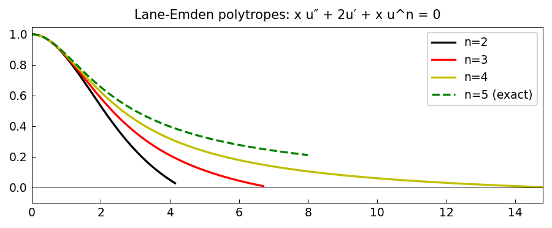

# Lane-Emden equation from astrophysics (nonlinear)

*Alex Townsend, May 2011*

[Chebfun example](https://www.chebfun.org/examples/ode-nonlin/laneemdennonlin.html)

## Overview

Solves the nonlinear Lane-Emden equation for polytropic indices $n = 2, 3, 4$:

$$\theta'' + \frac{2}{\xi}\theta' + \theta^n = 0, \quad \theta(0) = 1, \; \theta'(0) = 0$$

and the $n=5$ case which has the exact solution $\theta = (1 + \xi^2/3)^{-1/2}$.

```python
from scipy.integrate import solve_ivp

def lane_emden(xi, y, n):
    theta, dtheta = y
    if xi < 1e-10:
        return [dtheta, -1/3]  # L'Hopital limit
    return [dtheta, -theta**n - 2/xi * dtheta]
```



