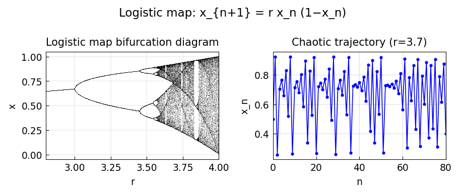

# Logistic map and chaos

*Nick Trefethen, July 2013*

[Chebfun example](https://www.chebfun.org/examples/ode-nonlin/Logistic.html)

## Overview

Explores the logistic map $x_{n+1} = r x_n(1 - x_n)$ and its bifurcation
diagram showing period-doubling cascades and the onset of chaos.
The Feigenbaum constant $\delta \approx 4.669$ governs the cascade.

```python
import numpy as np

r_vals = np.linspace(2.5, 4.0, 1000)
x = 0.5 * np.ones(len(r_vals))
for _ in range(300):  # transient
    x = r_vals * x * (1 - x)
x_orbit = np.zeros((50, len(r_vals)))
for i in range(50):
    x = r_vals * x * (1 - x)
    x_orbit[i] = x
```



