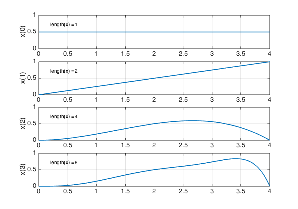
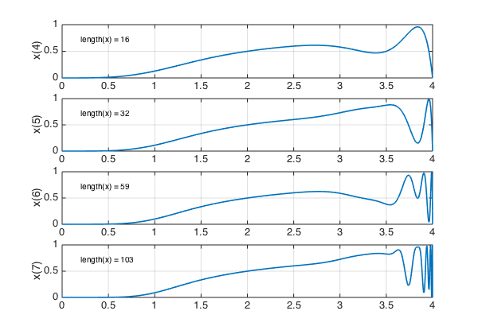
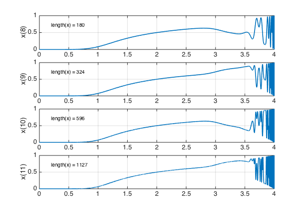
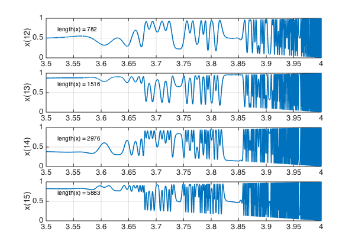
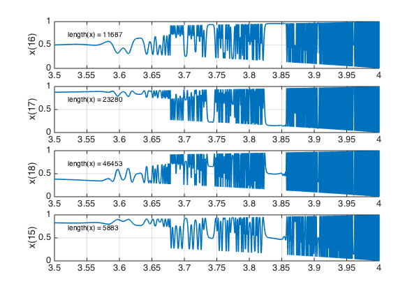
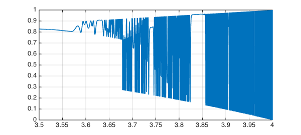
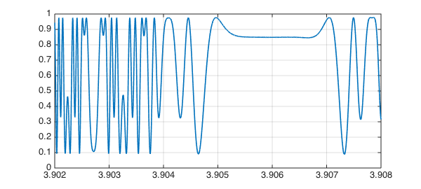

<!-- Generated by scripts/sync_chebfun_examples.py. -->
<!-- Source: https://www.chebfun.org/examples/ode-nonlin/Logistic.html -->

<h1>Logistic map and chaos</h1>
<h2>Nick Trefethen, July 2013 in <a href='../'>ode-nonlin</a><a href='/examples/ode-nonlin/Logistic.m'>download</a>&middot;<a href='//github.com/chebfun/examples/blob/master/ode-nonlin/Logistic.m'>view on GitHub</a></h2>

This example comes from a presentation by Qiqi Wang at Oxford in June 2013.

The logistic map is the iteration

$$ x_{n+1} = r x_n (1-x_n), $$

where $r$ is a parameter in the interval $[0,4]$. The map behaves chaotically for certain larger values of $r$, and as $r$ increases, one has the classical example of period doubling as a route to chaos. A picture appears on the back cover of Strang's <em>Introduction to Applied Mathematics</em> [1].

Let's start our iteration with the constant value $x=0.5$, and see how it evolves for a range of values of $r$. Here are steps 0-3:

<pre class="mcode-input">set(gcf, 'position', [0 0 600 420])
r = chebfun('r',[0 4]);
x = 0.5 + 0*r;
for n = 0:3
  subplot(4,1,n+1)
  plot(x), grid on, ylim([0 1])
  ylabel(['x(' int2str(n) ')'])
  text(.2,.7,['length(x) = ' int2str(length(x))])
  x = r.*x.*(1-x);
end</pre>

Here are steps 4-7:

<pre class="mcode-input">for n = 4:7
  subplot(4,1,n-3)
  plot(x), grid on, ylim([0 1])
  ylabel(['x(' int2str(n) ')'])
  text(.2,.7,['length(x) = ' int2str(length(x))])
  x = r.*x.*(1-x);
end</pre>

Here are steps 8-11:

<pre class="mcode-input">for n = 8:11
  subplot(4,1,n-7)
  plot(x), grid on, ylim([0 1])
  ylabel(['x(' int2str(n) ')'])
  text(.2,.7,['length(x) = ' int2str(length(x))])
  x = r.*x.*(1-x);
end</pre>

Let's zoom in on the region $[3.5,4]$ and look at steps 12-15:

<pre class="mcode-input">r = r{3.5,4}; x = x{3.5,4};
for n = 12:15
  subplot(4,1,n-11)
  plot(x), grid on, ylim([0 1])
  ylabel(['x(' int2str(n) ')'])
  text(3.52,.7,['length(x) = ' int2str(length(x))])
  x = r.*x.*(1-x);
end</pre>

And here are steps 16-18:

<pre class="mcode-input">for n = 16:18
  subplot(4,1,n-15)
  plot(x), grid on, ylim([0 1])
  ylabel(['x(' int2str(n) ')'])
  text(3.52,.7,['length(x) = ' int2str(length(x))])
  x = r.*x.*(1-x);
end</pre>

The reader can have some fun examining these pictures. Where do we see period 1, period 2, period 4, chaos? How does this match what is known about dependence on $r$?

Let's see the final plot more fully:

<pre class="mcode-input">figure
plot(x), ylim([0 1]), grid on</pre>

And let's zoom in on a small interval:

<pre class="mcode-input">plot(x,'interval',[3.902,3.908]), ylim([0 1]), grid on</pre>

<h3 id="references">References</h3>
<ol>
<li>G. Strang, <em>Introduction to Applied Mathematics</em>, Wellesley-Cambridge    Press, 1986.</li>
</ol>

        

    

    

        
&copy; Copyright 2025 the University of Oxford and the Chebfun Developers.

        
    

    
    
    
    
    
    
    
    
  </body>
</html>

