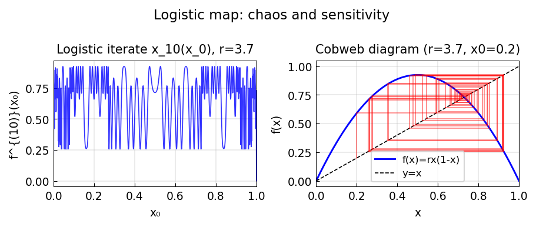

# The logistic map, again

*Nick Trefethen and Michal Konecny, August 2014*

[Chebfun example](https://www.chebfun.org/examples/ode-nonlin/logistic2.html)

## Overview

Treats the logistic map iteration $f^N(x_0)$ as a chebfun in $x_0$,
obtained by repeated composition. As $N$ grows, the function oscillates
more rapidly, capturing the period-doubling route to chaos.

```python
import numpy as np

r = 3.8  # chaotic regime
x0_vals = np.linspace(0, 1, 1000)

def logistic_iter(x, N):
    for _ in range(N):
        x = r * x * (1 - x)
    return x

for N in [1, 2, 4, 8]:
    orbit = logistic_iter(x0_vals.copy(), N)
```



