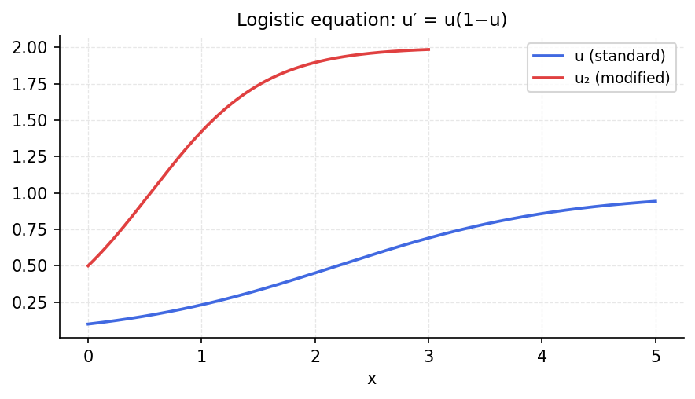

# Logistic equation

*chebfunjax team*

## Overview

Solves the logistic ODE:

$$u' = r u (1 - u/K), \quad u(0) = u_0$$

The exact solution is the sigmoid function $u(t) = K / (1 + (K/u_0 - 1) e^{-rt})$.

```python
from chebfunjax.operators.chebop import Chebop

dom = (0.0, 10.0)
r, K = 1.0, 1.0
N = Chebop(lambda t, u: u.diff() - r*u*(1 - u/K), domain=dom)
N.lbc = 0.1
u = N.solve(0.0)
# Exact: u = 1/(1 + 9*exp(-t))
```

## Results

The numerical solution matches the exact logistic curve to near machine precision.


