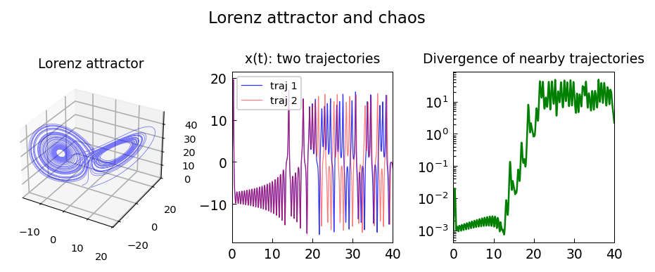

# Lorenz attractor

*Marcus Webb, March 2013*

[Chebfun example](https://www.chebfun.org/examples/ode-nonlin/lorenzattractor.html)

## Overview

Numerically integrates the Lorenz system:

$$\dot{x} = \sigma(y - x), \quad \dot{y} = x(\rho - z) - y, \quad \dot{z} = xy - \beta z$$

with $\sigma = 10$, $\rho = 28$, $\beta = 8/3$.
The trajectory displays the famous butterfly attractor.
The sensitive dependence on initial conditions (chaos) is demonstrated
by showing two nearby trajectories diverge exponentially.

```python
from scipy.integrate import solve_ivp

def lorenz(t, xyz, sigma=10, rho=28, beta=8/3):
    x, y, z = xyz
    return [sigma*(y-x), x*(rho-z)-y, x*y-beta*z]

sol = solve_ivp(lorenz, [0, 50], [1, 1, 1], rtol=1e-10)
```



