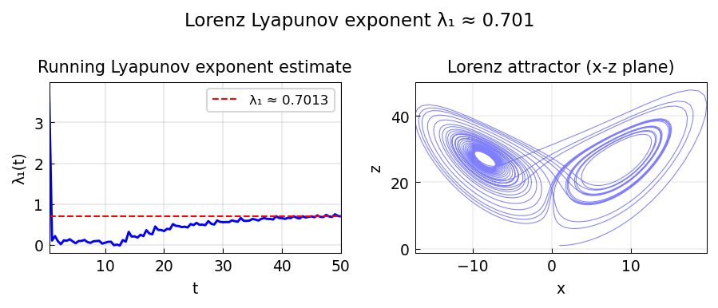

# Lyapunov exponents of the Lorenz system

*Hrothgar, January 2015*

[Chebfun example](https://www.chebfun.org/examples/ode-nonlin/lyapunovexponents.html)

## Overview

Computes the maximal Lyapunov exponent $\lambda_1$ of the Lorenz attractor
via the renormalization method. Two nearby trajectories are periodically
renormalized to estimate the exponential divergence rate.

The maximal Lyapunov exponent for the standard Lorenz parameters is
$\lambda_1 \approx 0.905$.

```python
from scipy.integrate import solve_ivp

# Renormalization method for maximal Lyapunov exponent
T_renorm = 0.5
n_steps = 200
delta = 1e-9

sigma, rho, beta = 10, 28, 8/3
# Integrate reference and perturbed trajectories
```



