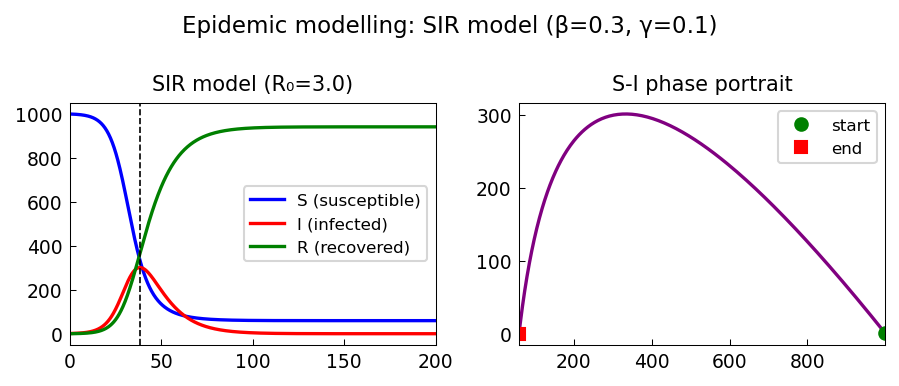

# Modelling infectious disease outbreaks

*Hrothgar, October 2014*

[Chebfun example](https://www.chebfun.org/examples/ode-nonlin/modellingdiseases.html)

## Overview

Simulates the SIR epidemic model:

$$S' = -\beta SI, \quad I' = \beta SI - \gamma I, \quad R' = \gamma I$$

Explores how the basic reproduction number $R_0 = \beta/\gamma$ determines
whether an outbreak occurs and computes the final epidemic size.

```python
from scipy.integrate import solve_ivp

def sir(t, y, beta=0.3, gamma=0.1):
    S, I, R = y
    N = S + I + R
    return [-beta*S*I/N, beta*S*I/N - gamma*I, gamma*I]

sol = solve_ivp(sir, [0, 200], [999, 1, 0], rtol=1e-10)
```



