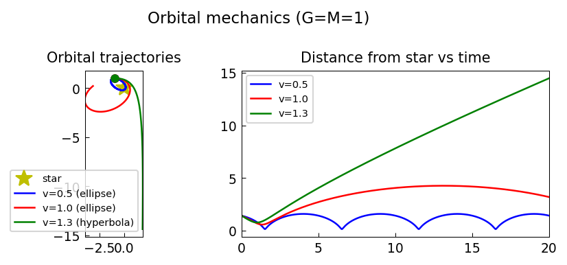

# Orbiting around fixed stars

*Nick Trefethen, November 2011*

[Chebfun example](https://www.chebfun.org/examples/ode-nonlin/orbits.html)

## Overview

Computes planetary orbits around a fixed star using Newton's law of gravity.
Different initial velocities yield circular, elliptical, parabolic, and
hyperbolic orbits.

```python
from scipy.integrate import solve_ivp

G, M = 1.0, 1.0

def gravity(t, state):
    x, y, vx, vy = state
    r3 = (x**2 + y**2)**1.5
    return [vx, vy, -G*M*x/r3, -G*M*y/r3]
```



