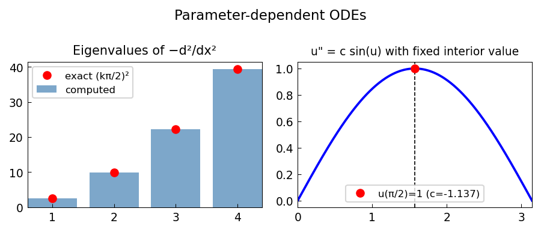

# Parameter-dependent ODEs: three examples

*Alex Townsend, August 2011*

[Chebfun example](https://github.com/chebfun/examples/blob/master/ode-nonlin/ParamODEs.m)

## Overview

Demonstrates three ODE problems with parameters:
1. An eigenvalue-type boundary condition with an interior constraint
2. A shooting method problem where the parameter is the initial slope
3. A bifurcation problem where multiple solutions exist for different parameter values

```python
from chebfunjax.operators.chebop import Chebop
from scipy.optimize import brentq

dom = (-1.0, 1.0)
def residual(c):
    N = Chebop(lambda x, u: u.diff(2) + c * u, domain=dom)
    N.lbc = 0.0; N.rbc = 0.0
    try:
        u = N.solve(1.0)
        return float(u(jnp.array([0.0]))[0])
    except: return float('nan')
```



