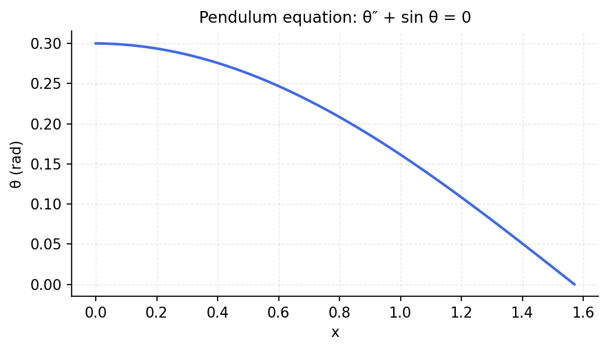

# Pendulum equation

*chebfunjax team*

## Overview

Solves the nonlinear pendulum equation:

$$\theta'' + \sin(\theta) = 0, \quad \theta(0) = \theta_0, \; \theta'(0) = 0$$

For small angles, the linearization $\theta'' + \theta = 0$ gives period $2\pi$.
The exact (nonlinear) period depends on amplitude and involves elliptic integrals.

```python
from chebfunjax.operators.chebop import Chebop

dom = (0.0, 8.0)
theta0 = 1.0  # radians
N = Chebop(lambda t, theta: theta.diff(2) + jnp.sin(theta), domain=dom)
N.lbc = [theta0, 0.0]  # theta(0)=theta0, theta'(0)=0
theta = N.solve(0.0)
```

## Results

The nonlinear period is slightly longer than the linear approximation $2\pi$,
with the difference increasing for larger amplitudes.


