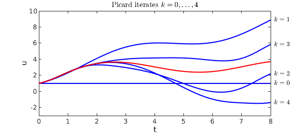
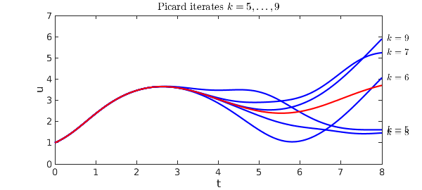
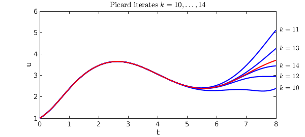
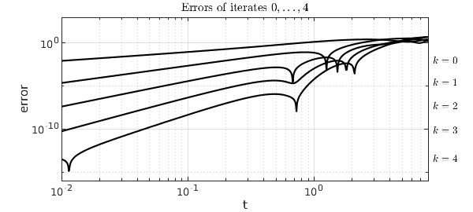

<!-- Generated by scripts/sync_chebfun_examples.py. -->
<!-- Source: https://www.chebfun.org/examples/ode-nonlin/Picard.html -->

<h1>Picard iteration for ODE existence proof</h1>
<h2>Nick Trefethen, January 2016 in <a href='../'>ode-nonlin</a><a href='/examples/ode-nonlin/Picard.m'>download</a>&middot;<a href='//github.com/chebfun/examples/blob/master/ode-nonlin/Picard.m'>view on GitHub</a></h2>

In the theory of ODEs, there is a basic theorem of existence and uniqueness that is the foundation for everything (see, e.g., [1]).

<em>Theorem.</em> <em>If $f$ is continuous with respect to $t$ and Lipschitz continuous with respect to $u$, the first-order IVP</em> $$ u'= f(t,u), \quad t\in [0,d], ~~ \quad u(0) = u_0 $$ <em>has a unique solution.</em>

This theorem applies to systems as well as scalars, and since a higher-order equation can be written as a system of first-order equations, it covers higher-order ODEs too.

The standard proof of the theorem is based on Picard (= Picard-Lindelof) iteration, and it can be illustrated in Chebfun using the <code>cumsum</code> command.  The proof is based on noting that the ODE is equivalent to $$ u(t) = u_0 + \int_0^t f(s,u(s)) ds . $$ In the Picard iteration, we successively consider

$$ u^{(0)} = u_0, ~~~
u^{(1)} = u_0 + \int_0^t f(s,u^{(0)}(s)) ds,  ~~~
u^{(2)} = u_0 + \int_0^t f(s,u^{(1)}(s)) ds, $$

and so on.  One can prove with the given assumptions that this process converges to a unique solution of (1).

Let us see the iteration in action for the problem $$ u' = \sin(u) + \sin(t), \quad t\in [0,8], ~~ u(0) = 1, $$ whose solution we can compute like this:

<pre class="mcode-input">d = 8; t = chebfun('t',[0 d]); u0 = 1;
L = chebop(0,d); L.op = @(t,u) diff(u) - sin(u); L.lbc = u0;
uexact = L\sin(t);</pre>

This first plot shows iterates $k = 0,\dots,4$, with the exact solution in red.

<pre class="mcode-input">u = u0 + 0*t;
f = @(u,t) sin(u) + sin(t);
IN = 'interpret'; LT = 'latex';
hold off
ss = @(k) ['$k = ' int2str(k) '$'];
for k = 0:4
  plot(u,'b'), hold on, ylim([-3 10])
  text(1.015*d,u(end),ss(k),IN,LT)
  u = u0 + cumsum(f(u,t));
end
plot(uexact,'r'), xlabel('t'), ylabel('u')
title('Picard iterates $k = 0,\dots,4$',IN,LT)</pre>

A second plot shows $k = 5,\dots,9$.

<pre class="mcode-input">hold off
for k = 5:9
  plot(u,'b'), hold on, ylim([0 7])
  text(1.015*d,u(end),ss(k),IN,LT)
  u = u0 + cumsum(f(u,t));
end
plot(uexact,'r'), xlabel('t'), ylabel('u')
title('Picard iterates $k = 5,\dots,9$',IN,LT)</pre>

A third plot shows $k = 10,\dots ,14$.

<pre class="mcode-input">hold off
for k = 10:14
  plot(u,'b'), hold on, ylim([1 6])
  text(1.015*d,u(end),ss(k),IN,LT)
  u = u0 + cumsum(f(u,t));
end
plot(uexact,'r'), xlabel('t'), ylabel('u')
title('Picard iterates $k = 10,\dots,14$',IN,LT)</pre>

These plots show vividly the kind of convergence one can expect from a Picard iteration: starting at the initial condition, sweeping slowly across the domain. There is a numerical method based on this idea, called <em>waveform relaxation</em>, but one can see immediately from the pictures that it is unlikely to be efficient when carried out over long time intervals.  Instead, standard numerical methods just march once rather than many times from left to right, but they march with a small discrete time step and a discrete formula of higher order.

To see the convergence in a quantitative fashion, it is interesting plot the errors of iterates $0,\dots, 4$ as a function of $t$ on a loglog plot.  The zeroth iterate has accuracy $O(t)$, the first has accuracy $O(t^2)$, and so on:

<pre class="mcode-input">u = u0 + 0*t;
ss = @(k) ['$k = ' int2str(k) '$'];
tt = logspace(-2,log10(8),600); hold off
for k = 0:4
  errtt = abs(u(tt)-uexact(tt));
  loglog(tt,errtt,'k'), hold on
  text(8.7,errtt(1),ss(k),IN,LT)
  u = u0 + cumsum(f(u,t));
end
xlabel('t'), ylabel('error')
axis([1e-2 8 1e-16 1e3]), grid on
title('Errors of iterates $0,\dots,4$',IN,LT)</pre>

Reference:

[1] E. A. Coddington and N. Levinson, <em>Theory of Ordinary Differential Equations</em>, McGraw-Hill, 1955.

        

    

    

        
&copy; Copyright 2025 the University of Oxford and the Chebfun Developers.

        
    

    
    
    
    
    
    
    
    
  </body>

