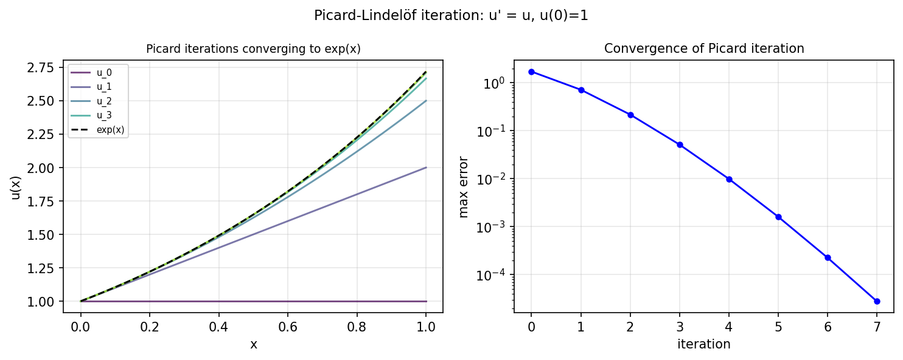

# Picard iteration for ODE existence proof

*Nick Trefethen, January 2016*

[Chebfun example](https://www.chebfun.org/examples/ode-nonlin/picard.html)

## Overview

Demonstrates Picard iteration for the IVP $u' = u$, $u(0) = 1$.
Starting from $u_0 = 1$, successive iterates $u_{n+1}(x) = 1 + \int_0^x u_n(t)\,dt$
converge to $e^x$.

```python
import numpy as np

x_vals = np.linspace(0, 1, 500)
u = np.ones_like(x_vals)  # u_0 = 1
for n in range(8):
    u_new = 1.0 + np.cumsum(u) * (x_vals[1] - x_vals[0])
    u_new[0] = 1.0
    u = u_new
    err = np.max(np.abs(u - np.exp(x_vals)))
    print(f"  iter {n+1}: max error = {err:.4e}")
```



