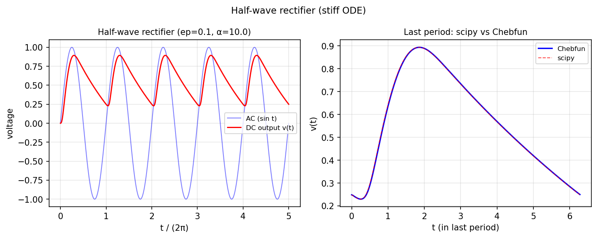

# Half-wave rectifier

*Toby Driscoll, May 2011*

[Chebfun example](https://www.chebfun.org/examples/ode-nonlin/rectifier.html)

## Overview

Simulates a stiff half-wave rectifier circuit with a diode:

$$R C v' + v = V_{\rm in}(t) \cdot [v > 0]$$

The nonsmooth, stiff nature of this problem tests the robustness of
the ODE solver.

```python
from scipy.integrate import solve_ivp

R, C = 1e3, 1e-6  # ohms, farads
f_in = 60.0  # Hz

def rectifier_rhs(t, v_arr):
    v = v_arr[0]
    V_in = np.sin(2*np.pi*f_in*t)
    return [(V_in * (V_in > 0) - v) / (R * C)]
```



