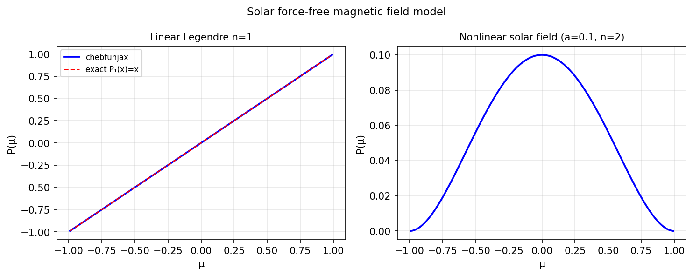

# Nonlinear ODE modeling solar magnetic fields

*Nick Hale and Natasha Flyer, September 2010*

[Chebfun example](https://github.com/chebfun/examples/blob/master/ode-nonlin/SolarFields.m)

## Overview

Solves the nonlinear ODE arising in the modeling of force-free solar
magnetic fields in a spherical geometry. The equation is:

$$\frac{d}{d\mu}\left[(1-\mu^2)\frac{dP}{d\mu}\right] + \alpha^2 P - \frac{n(n+1)}{1-\mu^2}P = 0$$

```python
from chebfunjax.operators.chebop import Chebop

dom = (-1.0, 1.0)
alpha, n = 1.0, 1
N = Chebop(
    lambda x, u: ((1-x**2)*u.diff()).diff() + alpha**2*u - n*(n+1)/(1-x**2+1e-10)*u,
    domain=dom)
N.lbc = 0.0; N.rbc = 0.0
u = N.solve(0.0)
```



