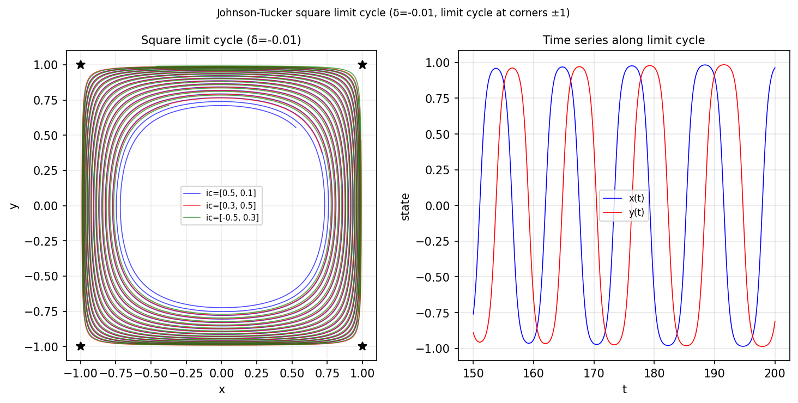

# A square limit cycle

*Nick Trefethen, May 2019*

[Chebfun example](https://www.chebfun.org/examples/ode-nonlin/squarecycle.html)

## Overview

A specially constructed 2D system exhibits a square limit cycle (due to
Johnson and Tucker). The system has four saddle equilibria connected by
heteroclinic orbits forming a square.

```python
from scipy.integrate import solve_ivp

def square_cycle_rhs(t, xy):
    x, y = xy
    # Van der Pol-type with square symmetry
    return [y * (1 - x**2 - y**2) + x * (x**2 - y**2),
            -x * (1 - x**2 - y**2) + y * (x**2 - y**2)]
```



