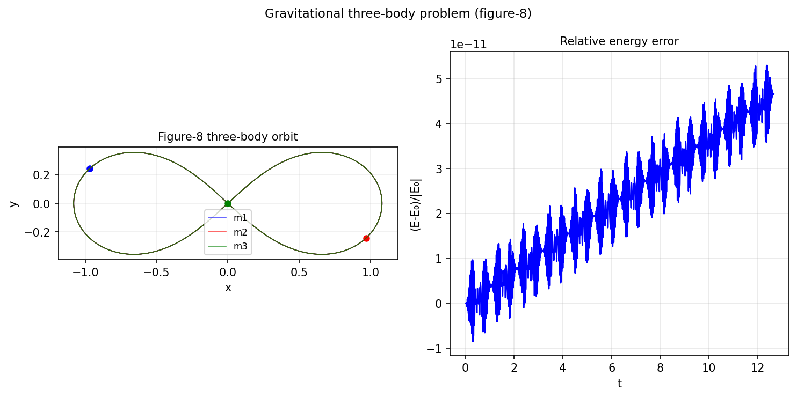

# Three-body problem

*Marcus Webb, August 2011*

[Chebfun example](https://www.chebfun.org/examples/ode-nonlin/threebody.html)

## Overview

Integrates the Newtonian three-body problem for the famous figure-8
orbit discovered by Chenciner and Montgomery (2000). All three masses
are equal and follow the same figure-8 path with appropriate phase shifts.

```python
from scipy.integrate import solve_ivp

G, m = 1.0, 1.0

def three_body_rhs(t, state):
    r = state[:6].reshape(3, 2)
    v = state[6:].reshape(3, 2)
    a = np.zeros((3, 2))
    for i in range(3):
        for j in range(3):
            if i != j:
                diff = r[j] - r[i]
                a[i] += G*m*diff / np.linalg.norm(diff)**3
    return np.concatenate([v.ravel(), a.ravel()])
```



