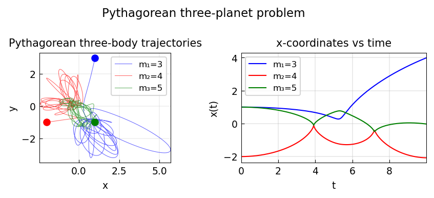

# Pythagorean planets

*Behnam Hashemi and Nick Trefethen, December 2014*

[Chebfun example](https://www.chebfun.org/examples/ode-nonlin/ThreePlanets.html)

## Overview

Integrates the famous Pythagorean three-body problem: three masses in the
ratio $3:4:5$ placed at the vertices of a 3-4-5 right triangle at rest.
The orbit is chaotic.

```python
from scipy.integrate import solve_ivp

G = 1.0
masses = np.array([3.0, 4.0, 5.0])

def pythagorean_rhs(t, state):
    r = state[:6].reshape(3, 2)
    v = state[6:].reshape(3, 2)
    a = np.zeros((3, 2))
    for i in range(3):
        for j in range(3):
            if i != j:
                diff = r[j] - r[i]
                a[i] += G*masses[j]*diff / np.linalg.norm(diff)**3
    return np.concatenate([v.ravel(), a.ravel()])
```



