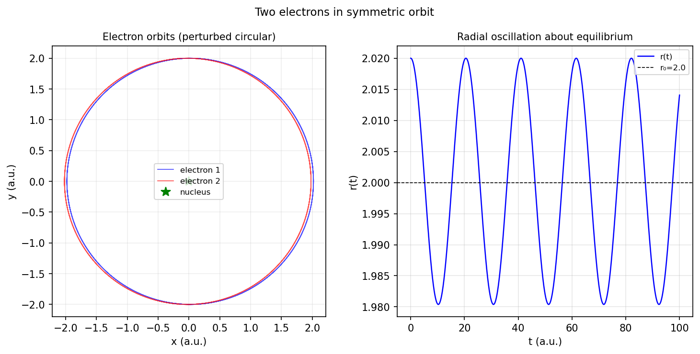

# Two electrons orbiting symmetrically about a nucleus

*Jeremy Fleury and Nick Trefethen, June 2016*

[Chebfun example](https://www.chebfun.org/examples/ode-nonlin/twoelectrons.html)

## Overview

Models two electrons in symmetric orbits around a proton, including
the electron-electron repulsion and Coulomb attraction:

$$H = \frac{p_r^2}{2} + \frac{p_\theta^2}{2r^2} - \frac{Z}{r} + \frac{1}{2r}$$

For circular orbits, the equilibrium radius $r_0$ and angular momentum
$p_\theta = \sqrt{(Z - 1/4)r_0}$ are computed.

```python
from scipy.integrate import solve_ivp

Z = 1.0; r0 = 2.0
ptheta0 = np.sqrt((Z - 0.25) * r0)

def two_electron_rhs(t, state):
    r, theta, pr, ptheta = state
    return [pr, ptheta/r**2,
            ptheta**2/r**3 - Z/r**2 + 1.0/(2*r)**2,
            0.0]
```



