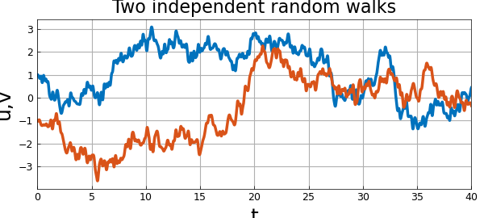
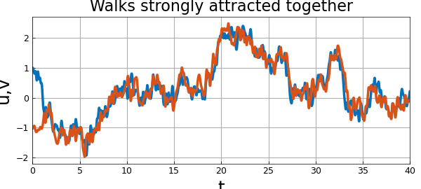
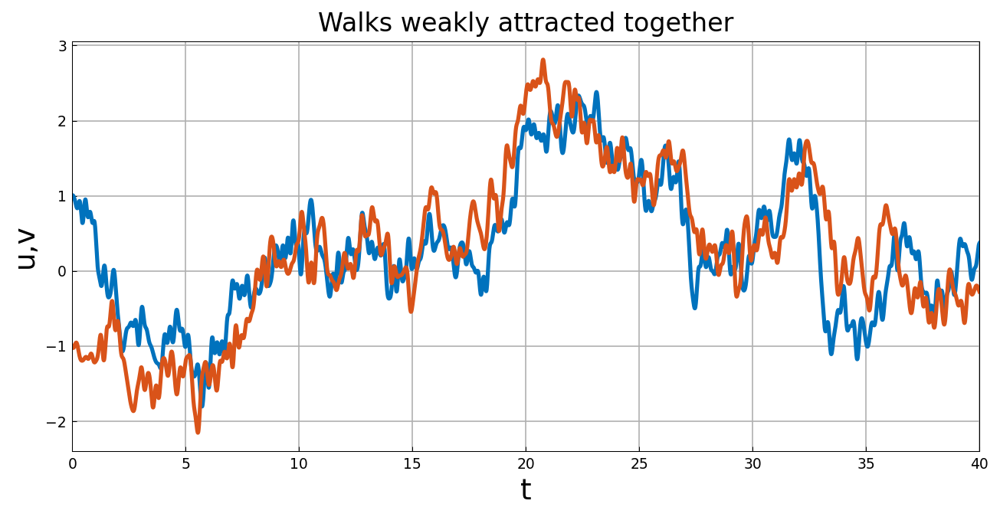

# Collective dynamics and consensus

*Nick Trefethen, May 2017*

[Original MATLAB Chebfun example](https://www.chebfun.org/examples/ode-random/Consensus.html)

Python translation: [`examples/ode-random/consensus.py`](https://github.com/ma-gilles/chebfunjax/blob/main/examples/ode-random/consensus.py)

Nick Trefethen, 30 May 2017

Here are two independent particles, each experiencing a smooth random walk. One starts at $d$ and the other at $-d$, with $d=1$.

```matlab
rng(3), dom = [0 40]; tic
N = chebop(dom);
lambda = 0.2;
f = randnfun(lambda,dom,'norm');
g = randnfun(lambda,dom,'norm');
N.op = @(t,u,v) [diff(u) + f; diff(v) + g];
d = 1; N.lbc = @(u,v) [u-d; v+d];
LW = 'linewidth'; lw = 2.5; FS = 'fontsize';
[u,v] = N\0; plot(u,LW,lw), grid on, hold on, plot(v,LW,lw), hold off
xlabel('t',FS,32), ylabel('u,v',FS,32)
title('Two independent random walks',FS,32)
```



Now let's change things by making the particles attract each other by a rule scaled with a constant $F=3$ when they are near to one another.

```matlab
F = 3;
N.op = @(t,u,v) [diff(u) + f + F*(u-v).*exp(-(u-v).^2); ...
                 diff(v) + g + F*(v-u).*exp(-(v-u).^2)];
[u,v] = N\0; plot(u,LW,lw), grid on, hold on, plot(v,LW,lw), hold off
xlabel('t',FS,32), ylabel('u,v',FS,32)
title('Walks strongly attracted together',FS,32)
```



Like Richard Burton and Elizabeth Taylor, the particles need not stay together forever; it's all a matter of the balance between attraction and random fluctuation. Here's an example in which $F$ has been reduced from $3$ to $1$.

```matlab
F = 1.0;
N.op = @(t,u,v) [diff(u) + f + F*(u-v).*exp(-(u-v).^2); ...
                 diff(v) + g + F*(v-u).*exp(-(v-u).^2)];
[u,v] = N\0; plot(u,LW,lw), grid on, hold on, plot(v,LW,lw), hold off
xlabel('t',FS,32), ylabel('u,v',FS,32)
title('Walks weakly attracted together',FS,32)
```



This model has connections with work by Eitan Tadmor and others on ``social hydrodynamics''. See for example [1].

[1] E. Tadmor, Mathematical aspects of self organized dynamics, *SIAM News*, November 2015.

---

*Translated with [chebfunjax](https://github.com/ma-gilles/chebfunjax); prose and MATLAB code from the original example, copyright The University of Oxford and The Chebfun Developers.  Printed outputs and figures are chebfunjax's.*
