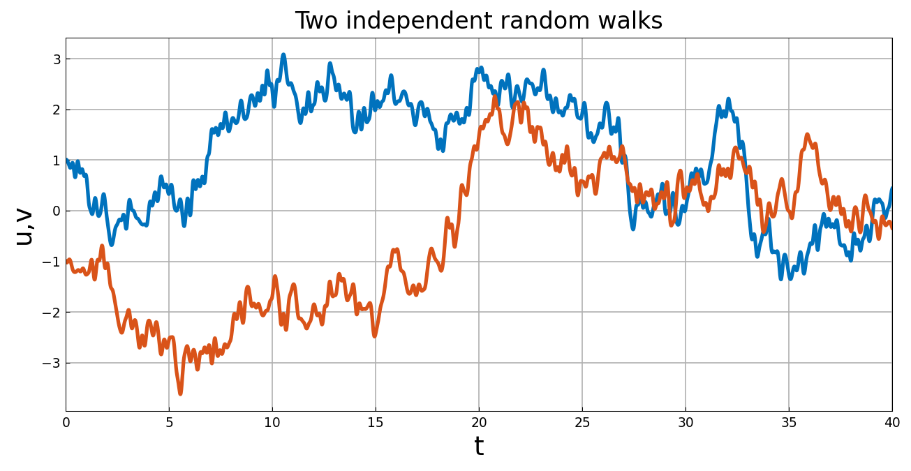
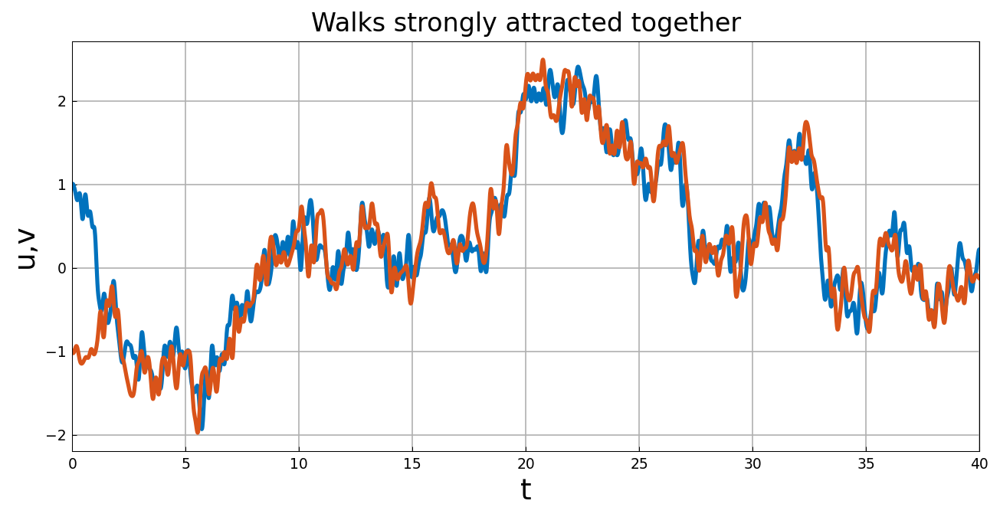
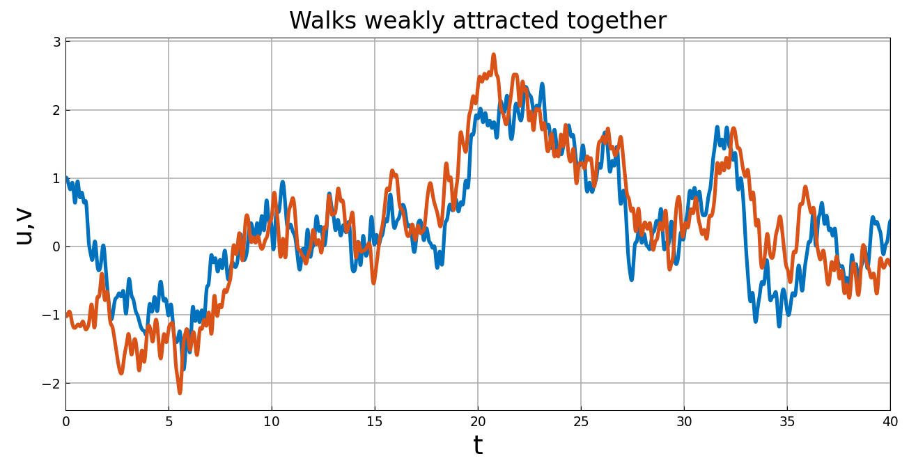

# Collective dynamics and consensus

*Nick Trefethen, May 2017*

[Original MATLAB Chebfun example](https://www.chebfun.org/examples/ode-random/Consensus.html)

(Chebfun example ode-random/Consensus.m)

Two independent particles, each experiencing a smooth random walk,
starting at $d = 1$ and $-d$:

$$ u' = -f, \qquad v' = -g, \qquad u(0) = 1,\ v(0) = -1 $$

Now make the particles attract each other when near, with strength
$F = 3$:

$$ u' + f + F(u-v)e^{-(u-v)^2} = 0, \qquad
v' + g + F(v-u)e^{-(v-u)^2} = 0 $$

Once the walks meet, they lock together. But like Richard Burton and
Elizabeth Taylor, the particles need not stay together forever; it's
all a matter of the balance between attraction and random
fluctuation. With $F$ reduced to $1$:

*(Sample paths use JAX keys — MATLAB's `rng(3)` stream is not
reproducible. The same noise samples are used across all three
panels, as in the original, so the coupled panels are directly
comparable to the independent one.)*

The model connects with Eitan Tadmor's work on "social
hydrodynamics."

---

*Replica script: [`examples/ode-random/consensus_replica.py`](https://github.com/ma-gilles/chebfunjax/blob/main/examples/ode-random/consensus_replica.py).
Original example copyright by The University of Oxford and The Chebfun
Developers.*
