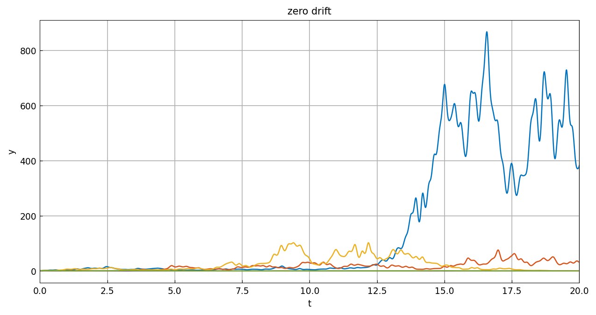
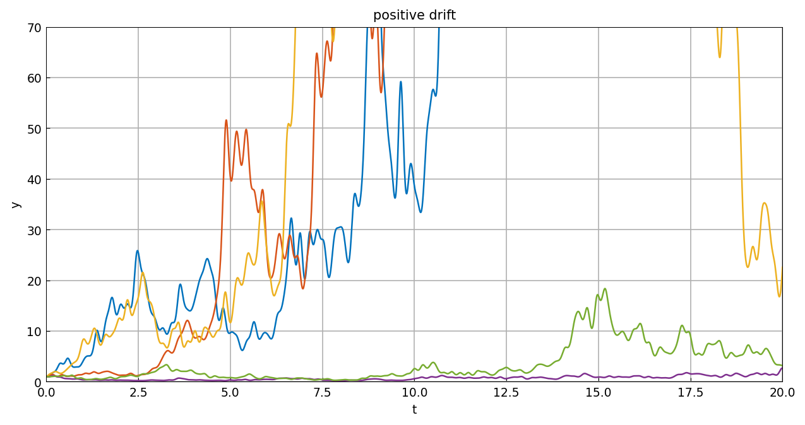
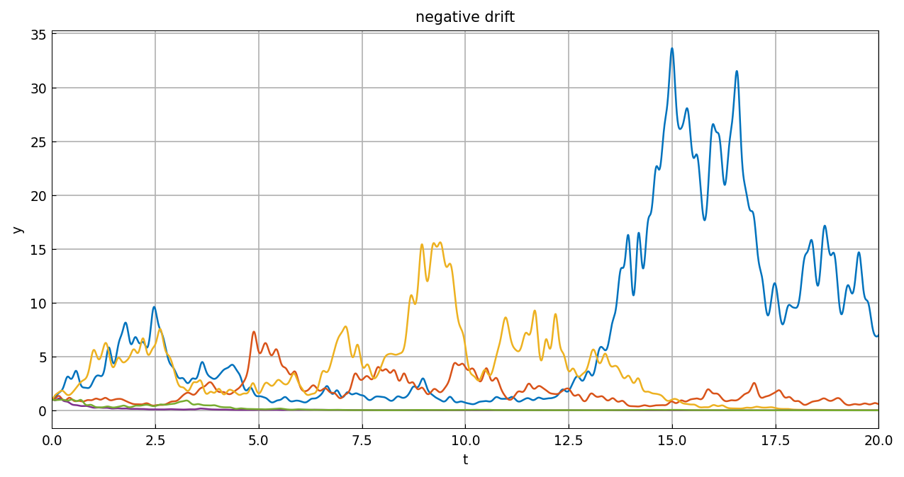

# Geometric Brownian motion

*Nick Trefethen, May 2017*

[Original MATLAB Chebfun example](https://www.chebfun.org/examples/ode-random/GBM.html)

(Chebfun example ode-random/GBM.m)

The linear constant-coefficient equation with *multiplicative* noise,

$$ y' = \mu y + \sigma f y, $$

is the smooth-random-function analogue of geometric Brownian motion
$dX_t = \mu X_t\,dt + \sigma X_t \circ dW_t$ (Stratonovich in the
$\lambda \to 0$ limit). Dividing by $y$ shows
$(\log y)' = \mu + \sigma f$: pure additive noise on a log scale.

Five trajectories with $\mu = 0$, $\sigma = 1$ — no bias on a log
scale, but large amplitudes on a linear one:



With $\mu = 0.2$ there is an upward bias on any scale:



With $\mu = -0.2$, decay:



*(Sample paths use JAX keys — MATLAB's `rng(0)` stream is not
reproducible. MATLAB caps runaway trajectories with
`L.maxnorm = 100`; these samples stay in range, with the plot window
clipping the largest positive-drift excursions exactly as in the
published figure.)*

```text
total_time_in_seconds =
  176.998461
```

(MATLAB publishes 9.9 s.)

---

*Replica script: [`examples/ode-random/gbm_replica.py`](https://github.com/ma-gilles/chebfunjax/blob/main/examples/ode-random/gbm_replica.py).
Original example copyright by The University of Oxford and The Chebfun
Developers.*
