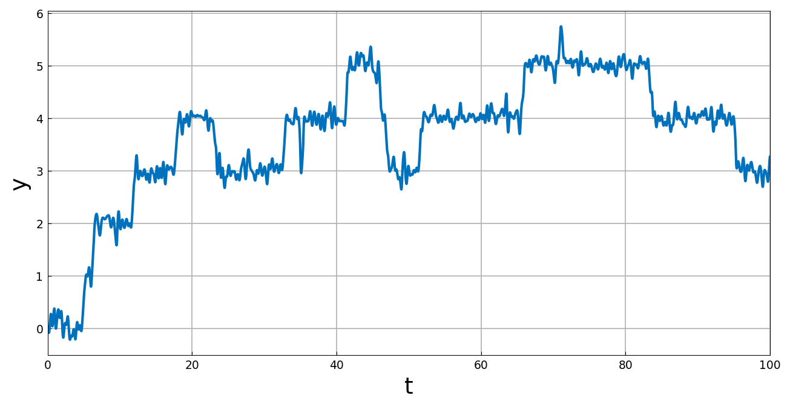
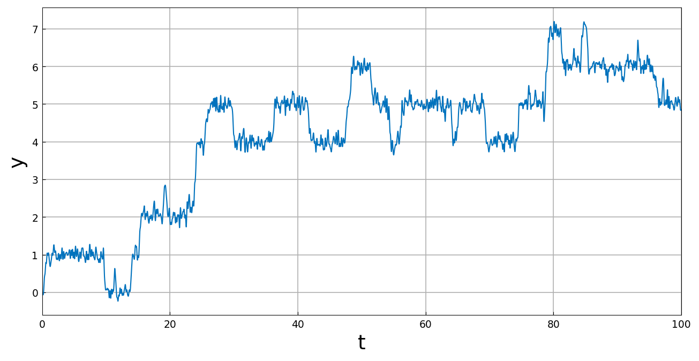

# Random level hopping

*Nick Trefethen, May 2017*

[Original MATLAB Chebfun example](https://www.chebfun.org/examples/ode-random/LevelHopping.html)

(Chebfun example ode-random/LevelHopping.m)

The equation $y' = -2\sin(2\pi y)$ has stable fixed points at the
integers. Adding noise,

$$ y' = -2\sin(2\pi y) + f, $$

gives a process that hops from one fixed point to another. On
$[0, 100]$ with $\lambda = 0.4$:



With $\lambda$ cut in half:



*(Sample paths use JAX keys — MATLAB's `rng(0)` stream is not
reproducible; these samples visit levels 0–6 and 0–7 respectively.)*

```text
total_time_in_seconds =
  134.397342
```

(MATLAB publishes 20.9 s.)

> **A solver bug this page found.** `(2*np.pi*y).sin()` inside the
> operator drove the first run to $y \sim 10^{17}$ *silently*: the IVP
> marcher's right-hand-side proxy lost its method-chain wrapper under
> arithmetic, raised `AttributeError`, and the solve fell back to a
> global Newton that diverged without warning. The proxy arithmetic
> now stays closed under the elementwise-method wrapper, and this page
> marches in seconds.

---

*Replica script: [`examples/ode-random/levelhopping_replica.py`](https://github.com/ma-gilles/chebfunjax/blob/main/examples/ode-random/levelhopping_replica.py).
Original example copyright by The University of Oxford and The Chebfun
Developers.*
