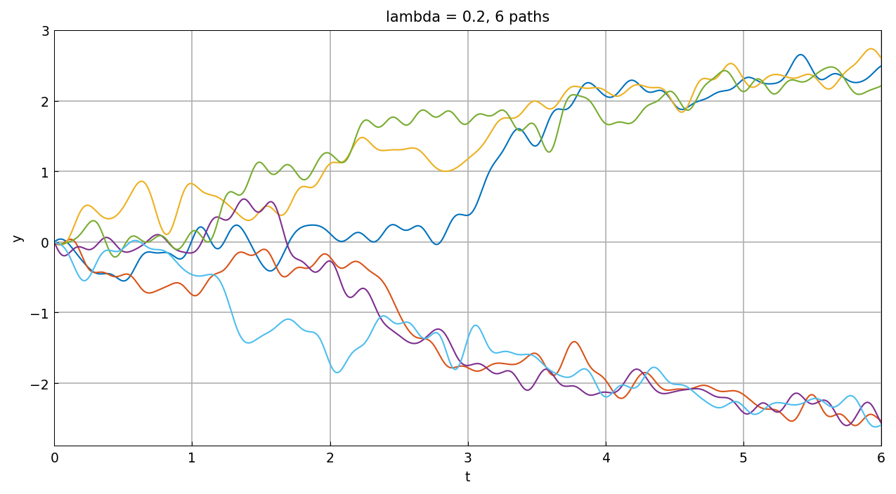
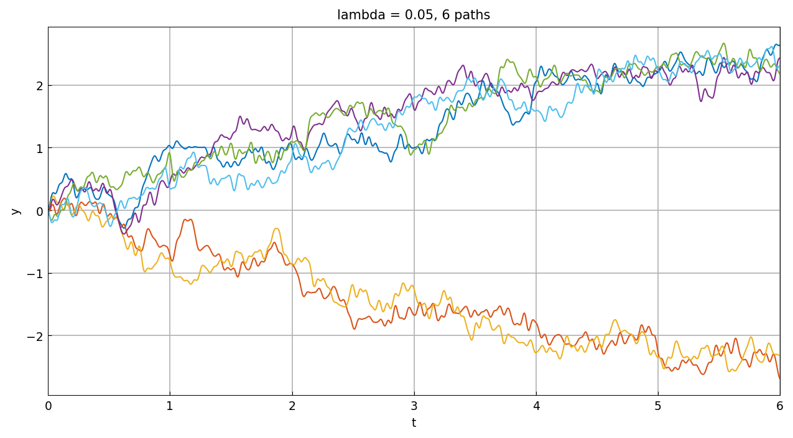
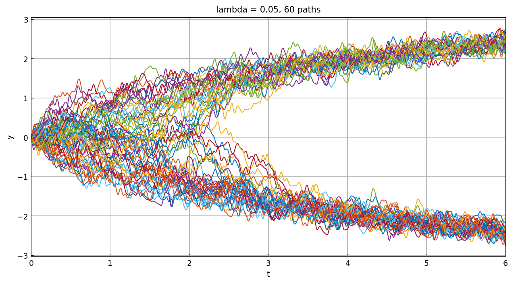

# Phase-locking in a Duffing-type equation

*Kevin Burrage and Nick Trefethen, May 2017*

[Original MATLAB Chebfun example](https://www.chebfun.org/examples/ode-random/PhaseLocking.html)

(Chebfun example ode-random/PhaseLocking.m)

Consider the bistable equation

$$ y' = ty - y^3 + f, \qquad y(0) = 0, $$

with $f$ a random term of fixed amplitude. The local fixed points
$\pm\sqrt{t}$ of the deterministic part separate as $t$ grows: for
small $t$ noise crosses the gap easily, but eventually every
trajectory settles onto a choice that is (almost surely) fixed
forever. Six paths with $\lambda = 0.2$:

The same with $\lambda = 0.05$:

And a much bigger sample — sixty paths splitting onto the two
branches of the parabola $\pm\sqrt{t}$:

*(Sample paths use JAX keys — MATLAB's `rng(0)` stream is not
reproducible. Panel times 42 s / 71 s / 656 s vs MATLAB's published
5.9 s / 6.4 s / 63 s — the same 10x per-trajectory ratio as the rest
of the category.)*

---

*Replica script: [`examples/ode-random/phaselocking_replica.py`](https://github.com/ma-gilles/chebfunjax/blob/main/examples/ode-random/phaselocking_replica.py).
Original example copyright by The University of Oxford and The Chebfun
Developers.*
