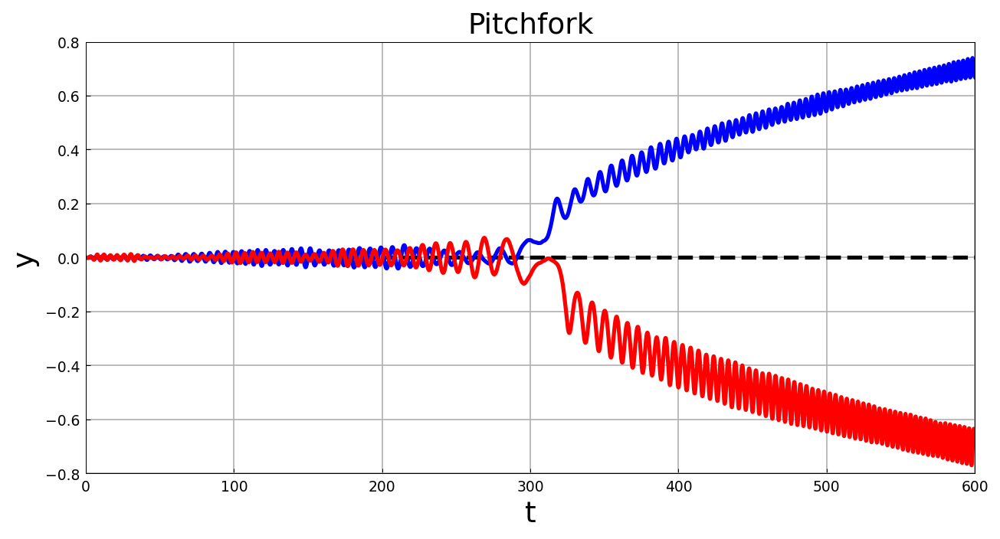
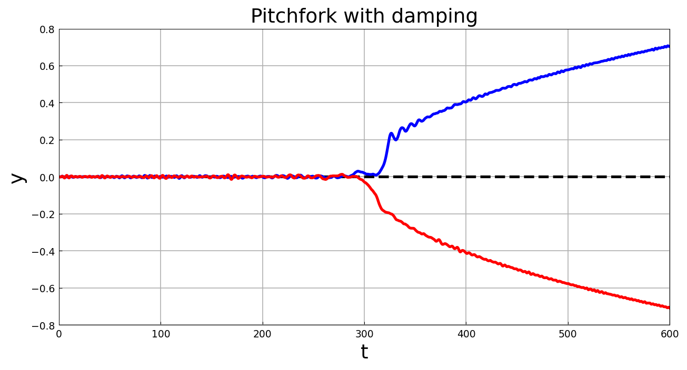

# Pitchfork bifurcation triggered by noise

*Nick Trefethen, May 2017*

[Original MATLAB Chebfun example](https://www.chebfun.org/examples/ode-random/Pitchfork.html)

(Chebfun example ode-random/Bifurcation.m)

The ODE $y'' = 2cy - 4y^3$ undergoes a pitchfork bifurcation at
$c = 0$: for $c < 0$ only $y = 0$ is a (stable) real fixed point;
for $c > 0$ it turns unstable and $y = \pm\sqrt{c/2}$ emerge. Sweep
the coefficient slowly through zero,

$$ y'' = 2c(t)y - 4y^3 + 0.003f(t), \quad c(t) = -1 + t/300,
\quad t \in [0, 600], $$

with $y(0) = y'(0) = 0$. Without noise the solution rides the
unstable branch forever (dashed); with noise it deviates at random
onto one branch or the other:



The solutions display big oscillations; a damping term $0.2y'$
changes this a good deal:



*(Sample paths use JAX keys — MATLAB's `rng(0)` stream is not
reproducible. Like the original — which notes "we flipped the sign on
one of them" — one noise sample's sign is flipped so the figure shows
both branches. Branch endpoints: $\pm0.67/0.69$ undamped,
$\pm0.70/0.71$ damped, hugging $\sqrt{c(600)/2} = 0.707$.)*

```text
total_time_in_seconds =
  97.475829
```

(MATLAB publishes 26.5 s.)

---

*Replica script: [`examples/ode-random/pitchfork_replica.py`](https://github.com/ma-gilles/chebfunjax/blob/main/examples/ode-random/pitchfork_replica.py).
Original example copyright by The University of Oxford and The Chebfun
Developers.*
