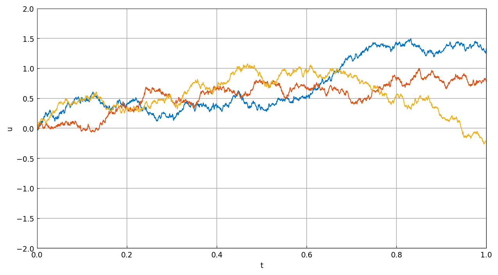

# From random functions to SDEs

*Nick Trefethen and Abdul-Lateef Haji-Ali, May 2017*

[Original MATLAB Chebfun example](https://www.chebfun.org/examples/ode-random/Random2SDE.html)

(Chebfun example ode-random/Random2SDE.m)

Smooth random functions (`randnfun` and its cousins) are band-limited
functions with independent random Fourier coefficients and minimal
wavelength $\lambda$. They make sample paths of *random ODEs* easy to
compute; as $\lambda \to 0$ these approach stochastic DEs in their
Stratonovich (not Itô) formulation. For ODE studies one always passes
`'big'`, which scales by $(\lambda/2)^{-1/2}$ — the scaling needed
for random ODEs to approximate SDEs.

The simplest example: $u' = f$, whose solution is the indefinite
integral of $f$ — a "smooth random walk". Three sample paths with
$\lambda = 0.001$ on $[0, 1]$:

```python
u = randnfun(0.001, (0.0, 1.0), big=True, key=...)
w = u.cumsum()
```



To the eye these look like true Brownian motion — for finite
$\lambda$, with no mathematical technicalities to worry about; a
stochastic analyst would write the same equation as $dX_t = dW_t$.

```text
total_time_in_seconds =
  22.344840
```

(MATLAB publishes 8.07 s. Sample paths use JAX keys — MATLAB's
`rng(0)` stream is not reproducible — so these are different samples
of the same law.)

---

*Replica script: [`examples/ode-random/random2sde_replica.py`](https://github.com/ma-gilles/chebfunjax/blob/main/examples/ode-random/random2sde_replica.py).
Original example copyright by The University of Oxford and The Chebfun
Developers.*
