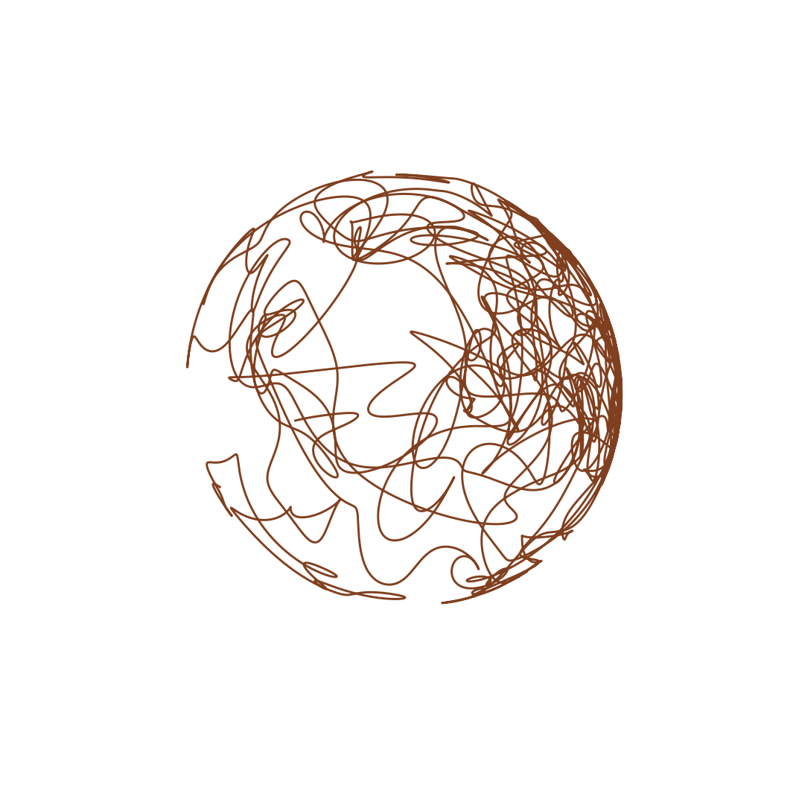
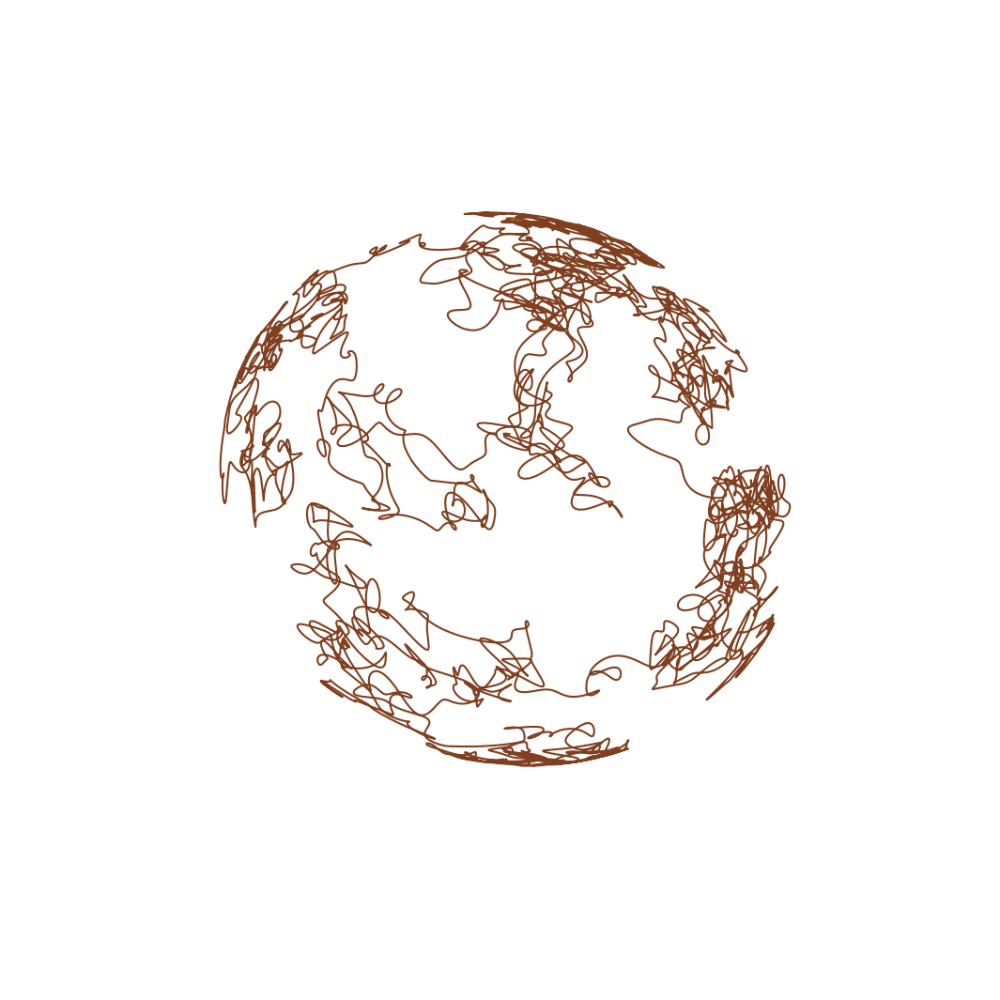

# Random trajectory on a sphere

*Kevin Burrage and Nick Trefethen, May 2017*

[Original MATLAB Chebfun example](https://www.chebfun.org/examples/ode-random/RandomOnASphere.html)

(Chebfun example ode-random/RandomOnASphere.m)

For skew-symmetric matrices $A, B, C$ (rotations about the three
axes), the random linear system

$$ \frac{du}{dt} = fAu + gBu + hCu $$

with independent smooth random coefficients conserves energy, so the
trajectory $u = (x, y, z)$ wanders forever on the unit sphere. On
$[0, 100]$ with $\lambda = 0.5$:

The energy conservation is verified to **radius drift
$5.4\times10^{-10}$** over the whole trajectory.

With $\lambda$ cut by a factor of 4 the path is correspondingly
rougher; like the MATLAB original — which loosens
`cheboppref` tolerances to $10^{-6}$ for this panel because "12-digit
accuracy is a waste here" — this run uses `ivp_reltol = 1e-6`
(radius drift $1.2\times10^{-4}$, consistent with that tolerance):

*(Sample paths use JAX keys — MATLAB's `rng(0)` stream is not
reproducible. Coefficients are evaluated pointwise through
precomputed trig series — the identical operator, 28x faster than
per-step chebfun evaluation in the marcher.)*

---

*Replica script: [`examples/ode-random/randomonasphere_replica.py`](https://github.com/ma-gilles/chebfunjax/blob/main/examples/ode-random/randomonasphere_replica.py).
Original example copyright by The University of Oxford and The Chebfun
Developers.*
