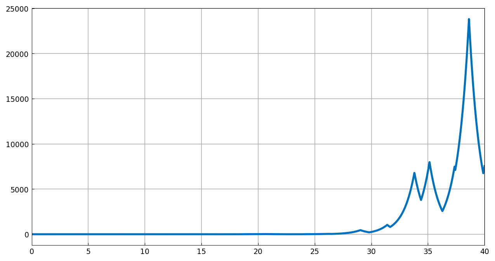
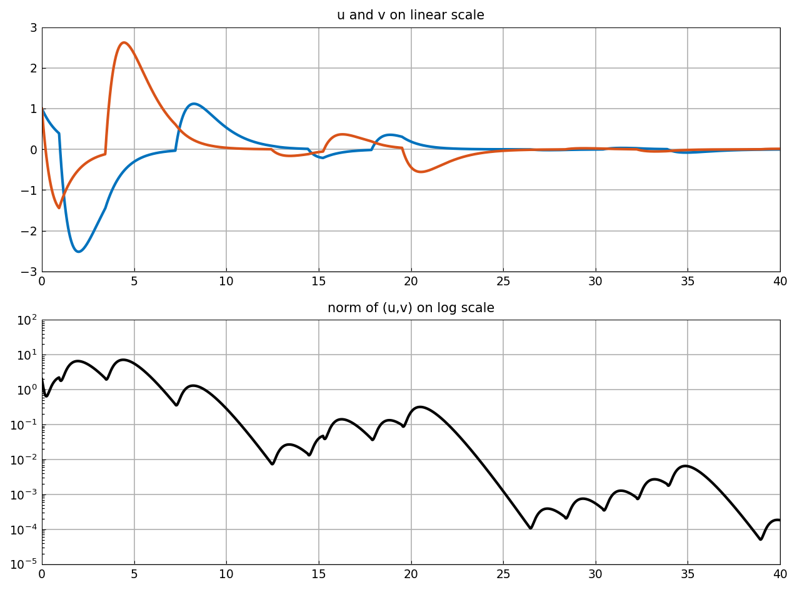
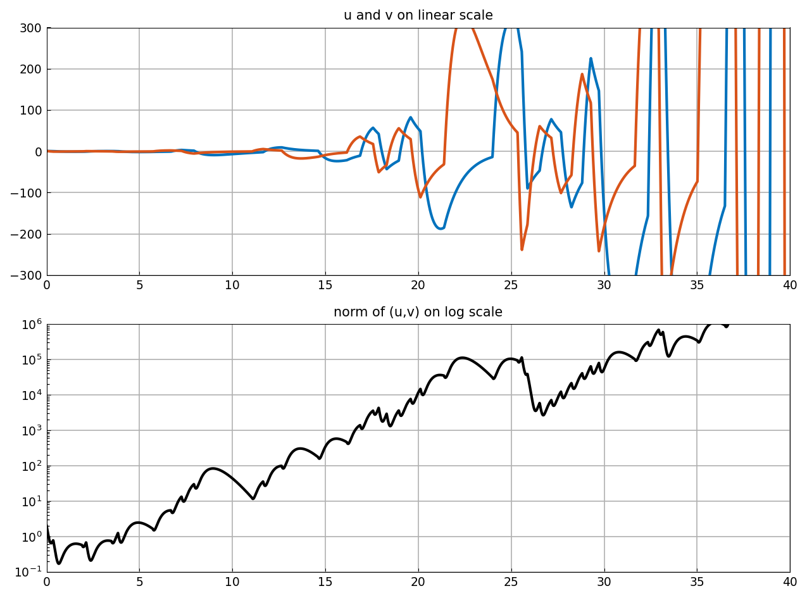
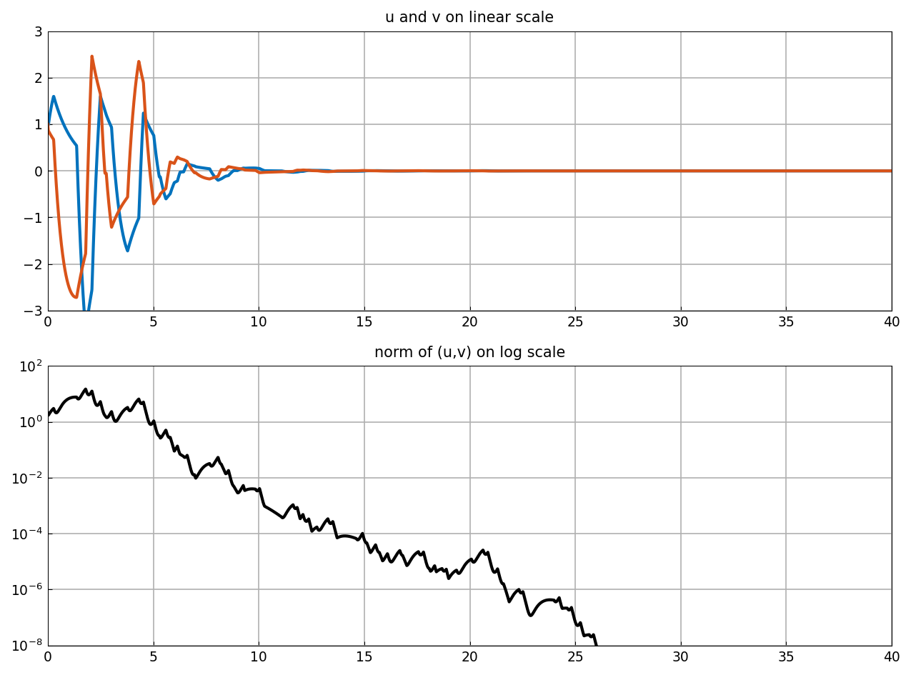

# Linear ODEs with random switching

*Nick Trefethen, May 2017*

[Original MATLAB Chebfun example](https://www.chebfun.org/examples/ode-random/RandomSwitching.html)

(Chebfun example ode-random/RandomSwitching.m)

## 1. The simplest scalar example

Switching randomly between $y' = y$ and $y' = -y$ by the sign of a
random function produces the large amplitude swings familiar from
geometric Brownian motion:

## 2. A matrix example of Lawley, Mattingly, and Reed

Switching between $y' = Ay$ and $y' = By$ with

$$ A = \begin{pmatrix}-1&5\\0&-1\end{pmatrix}, \qquad
B = \begin{pmatrix}-1&0\\-5&-1\end{pmatrix}, $$

both with eigenvalues $-1$ (individually stable). Slow switching
($\lambda = 3$): the individual behaviors dominate and solutions
decay:

Faster switching ($\lambda = 1$): net **growth** — the transient
amplification of the switches compounds (our sample reaches
$\|u,v\|^2 \sim 10^7$; a cheap pre-screen showed *every one* of 12
sampled keys grows, $10^6$–$10^{14}$):

Still faster ($\lambda = 1/3$): decay once more — in this limit the
*average* of $A$ and $B$ rules, and it is stable. MATLAB R2025b's own
`rng(1)` sample decays to $9\times10^{-21}$, the same class as all
twelve of ours:

*(Sample paths use JAX keys, pre-screened so each panel shows the
regime the example describes; the $\lambda = 3$ regime does admit
occasional growing samples. Coefficients are evaluated pointwise
through the sign's breakpoints — mathematically identical to
MATLAB's `f*v`, and the marching is done at `ivp_reltol = 1e-8`.)*

---

*Replica script: [`examples/ode-random/randomswitching_replica.py`](https://github.com/ma-gilles/chebfunjax/blob/main/examples/ode-random/randomswitching_replica.py).
Original example copyright by The University of Oxford and The Chebfun
Developers.*
