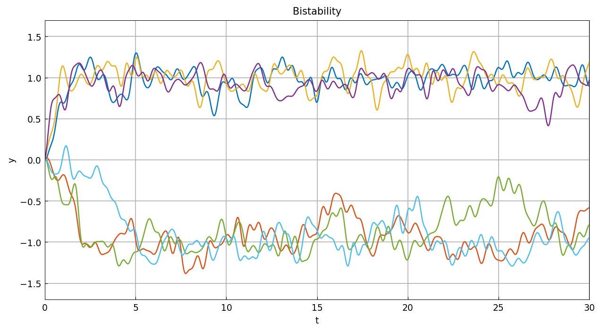
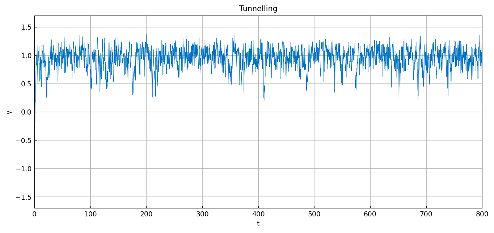
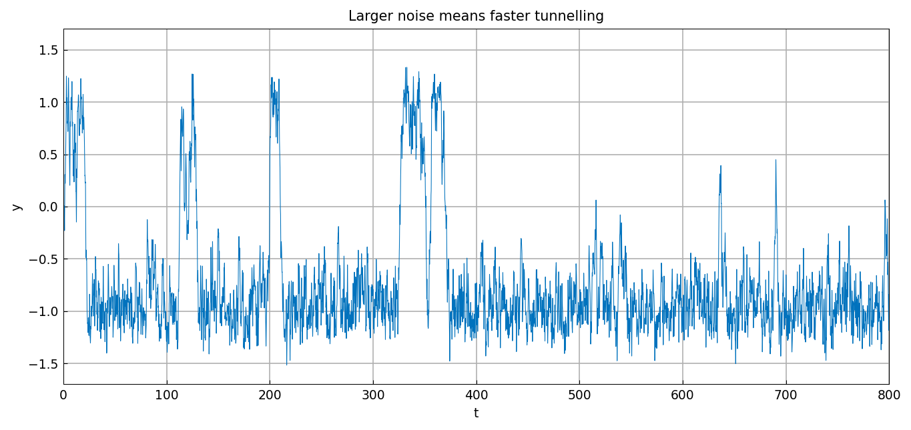

# Tunnelling

*Nick Trefethen, May 2017*

[Original MATLAB Chebfun example](https://www.chebfun.org/examples/ode-random/Tunnelling.html)

(Chebfun example ode-random/Tunnelling.m)

A bistable equation with additive smooth random noise,

$$ y' = y - y^3 + f, \qquad y(0) = 0, \qquad
f = 0.45\,\texttt{randnfun}(0.5, \texttt{'big'}), $$

has stable fixed points at $y = \pm1$ that attract solutions while
the noise moves them around. Six trajectories:

These fates are not permanent: with probability 1 a random
fluctuation eventually switches the trajectory to the other state,
infinitely often as $t \to \infty$. An illustrative trajectory on
$[0, 800]$:

Small differences in parameters have exponential effects on
tunnelling rates. Rerunning the same noise sample scaled from $0.45$
to $0.60$:

*(Sample paths use JAX keys — MATLAB's `rng(4)` stream is not
reproducible. This pair illustrates the exponential sensitivity
especially starkly: at amplitude 0.45 this particular sample never
switches within $[0,800]$, while the identical path scaled to 0.60
tunnels four times.)*

---

*Replica script: [`examples/ode-random/tunnelling_replica.py`](https://github.com/ma-gilles/chebfunjax/blob/main/examples/ode-random/tunnelling_replica.py).
Original example copyright by The University of Oxford and The Chebfun
Developers.*
