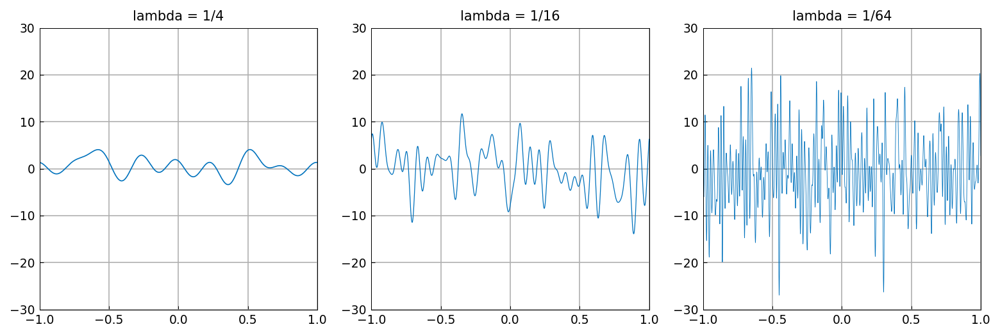

# The white noise paradox

*Nick Trefethen, May 2017*

[Original MATLAB Chebfun example](https://www.chebfun.org/examples/ode-random/WhiteNoiseParadox.html)

(Chebfun example ode-random/WhiteNoiseParadox.m)

White noise contains equal energy at all wave numbers — infinitely
many of them, hence infinite energy and infinite amplitude. Chebfun's
smooth random functions resolve the paradox by cutting off the wave
numbers at $O(2\pi/\lambda)$: here are samples with
$\lambda = 1/4, 1/16, 1/64$ in the `'big'` normalization, whose
amplitude grows as $\lambda$ shrinks:

```python
f = randnfun(lam, (-1.0, 1.0), big=True, key=...)
```



*(Sample paths drawn with JAX keys — MATLAB's `rng(1)` stream is not
reproducible in numpy/JAX, so these are different samples of the same
law, with the same $\pm 4 \to \pm 10 \to \pm 25$ amplitude
progression as the published figure.)*

In stochastic analysis the paradox is resolved by never dealing with
white noise directly, only its integral — a Brownian path, continuous
but nowhere differentiable with probability 1. The example goes on to
recount how two of Einstein's 1905 papers connect to the same
paradox: physical Brownian motion (where molecular scales cut off the
wave numbers, much as Chebfun does) and the quantization of light,
with Kragh's historical corrective that the "ultraviolet catastrophe"
was named by Ehrenfest in 1911 and was not, in fact, Planck's
motivation.

---

*Replica script: [`examples/ode-random/whitenoiseparadox_replica.py`](https://github.com/ma-gilles/chebfunjax/blob/main/examples/ode-random/whitenoiseparadox_replica.py).
Original example copyright by The University of Oxford and The Chebfun
Developers.*
