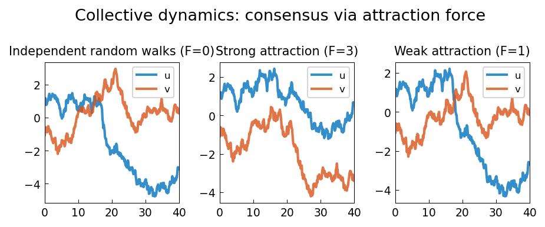

# Collective Dynamics and Consensus

**Original MATLAB:** [ode-random/Consensus](https://www.chebfun.org/examples/ode-random/Consensus.html)
**Author(s):** Nick Trefethen, May 2017

## Overview

Two particles undergoing independent random walks can be attracted together by a
nonlinear coupling force, demonstrating consensus dynamics — a phenomenon central
to multi-agent systems and social dynamics modeling.

## Mathematical Background

The coupled system:

$$\dot{u} = -f(t) + F(u-v)e^{-(u-v)^2}$$
$$\dot{v} = -g(t) + F(v-u)e^{-(v-u)^2}$$

The force $F(u-v)e^{-(u-v)^2}$ is the derivative of $-\frac{F}{2}e^{-(u-v)^2}$,
a Gaussian attractive potential. The coupling is strongest when $|u-v| \approx 1/\sqrt{2}$
and diminishes both when particles are very close and very far apart.

Three scenarios:
- $F = 0$: independent random walks
- $F = 3$: strong attraction → particles synchronize
- $F = 1$: weak attraction → partial synchronization (like Burton and Taylor!)

This model connects to Tadmor's work on social hydrodynamics [1].

## Code

```python
import chebfunjax as cj
import numpy as np

f_fn = cj.randnfun(0.2, domain=[0,40], seed=3, big=True)
g_fn = cj.randnfun(0.2, domain=[0,40], seed=4, big=True)

def rhs(t, uv):
    fi = np.interp(t, t_grid, f_vals)
    gi = np.interp(t, t_grid, g_vals)
    diff = uv[0] - uv[1]
    attract = diff * np.exp(-diff**2)
    return [-fi + F * attract, -gi - F * attract]
```

## References

[1] E. Tadmor, Mathematical aspects of self organized dynamics, *SIAM News*,
November 2015.

## Results

Strong coupling ($F = 3$) causes the two particles to synchronize and move
together. Weaker coupling ($F = 1$) gives partial synchronization.


