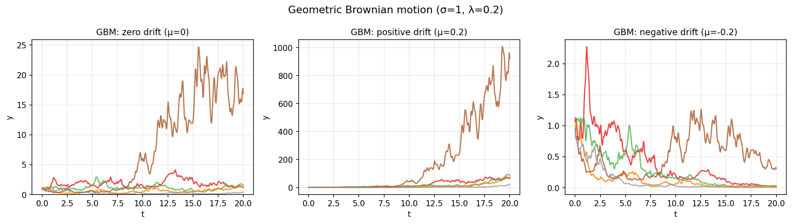

# Geometric Brownian Motion

**Original MATLAB:** [ode-random/GBM](https://www.chebfun.org/examples/ode-random/GBM.html)
**Author(s):** Nick Trefethen, May 2017

## Overview

Geometric Brownian motion (GBM) is the standard model for stock prices. The
multiplicative noise ODE

$$y' = \mu y + \sigma f y$$

where $f$ is a smooth random function, approaches the Stratonovich SDE
$dX = \mu X\, dt + \sigma X \circ dW$ as $\lambda \to 0$.

## Mathematical Background

Taking the logarithm transforms the multiplicative equation to additive:

$$(\log y)' = \mu + \sigma f$$

so $\log y(t) = \mu t + \sigma \int_0^t f(s)\, ds$, a simple integral computation.

For three drift scenarios:
- **Zero drift** ($\mu = 0$): $\log y$ is a random walk, no long-term trend on log scale
- **Positive drift** ($\mu = 0.2$): $y$ grows exponentially on average
- **Negative drift** ($\mu = -0.2$): $y$ decays exponentially on average

## Code

```python
import chebfunjax as cj
import numpy as np

domain = [0.0, 20.0]
lam = 0.2
mu, sigma = 0.0, 1.0

for k in range(5):
    f_fn = cj.randnfun(lam, domain=domain, seed=k, big=True)
    f_vals = np.array([float(f_fn(np.array(ti))) for ti in t_eval])
    f_cumsum = np.cumsum(f_vals) * dt
    log_y = mu * t_eval + sigma * f_cumsum
    y = np.exp(log_y)
```

## Results


