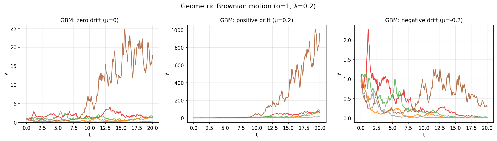
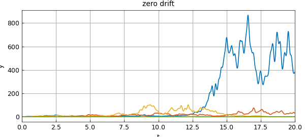
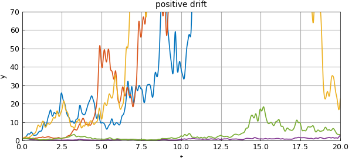
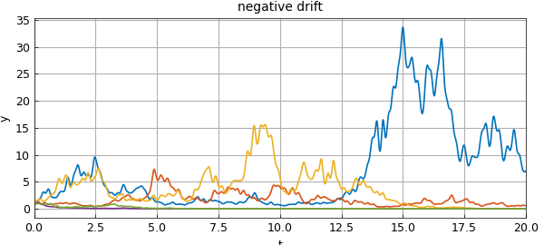

# Geometric Brownian Motion

**Original MATLAB:** [ode-random/GBM](https://www.chebfun.org/examples/ode-random/GBM.html)
**Author(s):** Nick Trefethen, May 2017

## Overview

Geometric Brownian motion (GBM) is the standard model for stock prices. The
multiplicative noise ODE

$$y' = \mu y + \sigma f y$$

where $f$ is a smooth random function, approaches the Stratonovich SDE
$dX = \mu X\, dt + \sigma X \circ dW$ as $\lambda \to 0$.

## Mathematical Background

Taking the logarithm transforms the multiplicative equation to additive:

$$(\log y)' = \mu + \sigma f$$

so $\log y(t) = \mu t + \sigma \int_0^t f(s)\, ds$, a simple integral computation.

For three drift scenarios:
- **Zero drift** ($\mu = 0$): $\log y$ is a random walk, no long-term trend on log scale
- **Positive drift** ($\mu = 0.2$): $y$ grows exponentially on average
- **Negative drift** ($\mu = -0.2$): $y$ decays exponentially on average

## Code

```python
import numpy as np
from scipy.integrate import solve_ivp

def randnfun(lam, dom, seed):
    """Band-limited random function (wavelength lam), normalized."""
    rng = np.random.default_rng(seed)
    a, b = dom
    m = int(2 * (b - a) / lam) + 1
    C = rng.standard_normal((m + 1, 2))
    def f(t):
        s = 2 * np.pi * (np.asarray(t) - a) / (b - a)
        out = sum(C[k, 0] * np.cos(k * s) + C[k, 1] * np.sin(k * s)
                  for k in range(m + 1))
        return out / np.sqrt((m + 1) * lam)
    return f

f = randnfun(0.2, (0, 20), 10)
sol = solve_ivp(lambda t, y: [0.2 * y[0] + 0.4 * f(t) * y[0]],
                (0, 20), [1.0], max_step=0.02)
print(f"GBM path final value: {sol.y[0][-1]:.4f}")
```

## Results



## Figures (chebfun.org parity)






