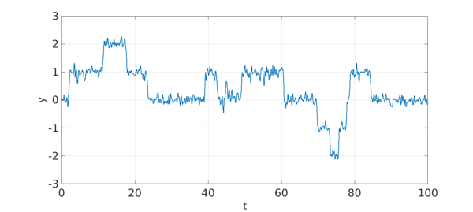
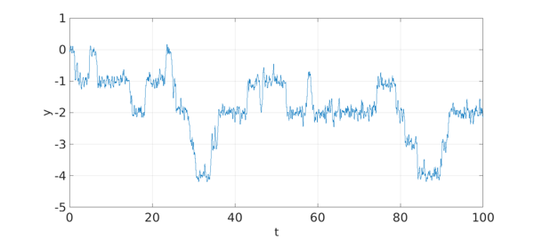

<!-- Generated by scripts/sync_chebfun_examples.py. -->
<!-- Source: https://www.chebfun.org/examples/ode-random/LevelHopping.html -->

<h1>Random level hopping</h1>
<h2>Nick Trefethen, May 2017 in <a href='../'>ode-random</a><a href='/examples/ode-random/LevelHopping.m'>download</a>&middot;<a href='//github.com/chebfun/examples/blob/master/ode-random/LevelHopping.m'>view on GitHub</a></h2>

The equation $y' = -2\sin(2\pi y)$ has stable fixed points when $y$ is an integer.  Let us add some noise, so that we have $$ y' = -2\sin(2\pi y) + f, $$ where $f$ is a random function.  This gives us a process that hops from one fixed point to another. We illustrate first for $t\in [0,100]$ with $\lambda = 0.4$.

<pre class="mcode-input">rng(0), dom = [0 100]; tic
N = chebop(dom);
lambda = 0.4; f = randnfun(lambda,dom,'norm');
N.op = @(y) diff(y) + 2*sin(2*pi*y); N.lbc = 0;
LW = 'linewidth'; FS = 'fontsize';
y = N\f; plot(y,LW,2), grid on
xlabel('t',FS,32), ylabel('y',FS,32)</pre>

Here we cut $\lambda$ in half.

<pre class="mcode-input">lambda = lambda/2;
f = randnfun(lambda,dom,'norm');
y = N\f; plot(y,LW,1), grid on
xlabel('t',FS,32), ylabel('y',FS,32)</pre>

<pre class="mcode-input">total_time_in_seconds = toc</pre>

<pre class="mcode-output">total_time_in_seconds =
  18.500097000000000
</pre>

        

    

