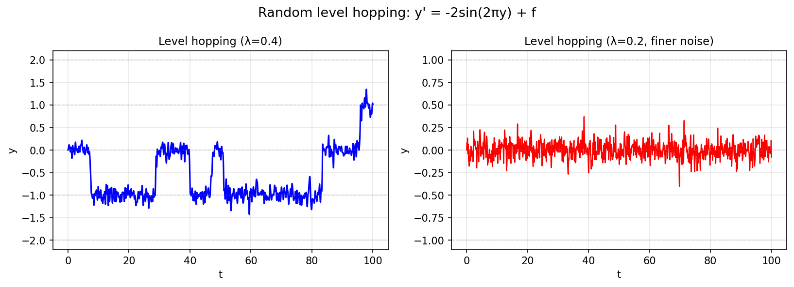

# Random Level Hopping

**Original MATLAB:** [ode-random/LevelHopping](https://www.chebfun.org/examples/ode-random/LevelHopping.html)
**Author(s):** Nick Trefethen, May 2017

## Overview

Solves the bistable ODE $y' = -2\sin(2\pi y) + f(t)$ where $f$ is a smooth
random function. The deterministic part has stable fixed points at all integers
and unstable fixed points at half-integers. Noise drives the trajectory to hop
between integer levels.

## Mathematical Background

The equilibria of $y' = -2\sin(2\pi y)$ are at $y = n$ (integers), where
$\partial/\partial y[-2\sin(2\pi y)] = -4\pi\cos(2\pi n) = -4\pi < 0$, confirming
stability at all integers.

With random forcing $f$, the solution hops between levels when the noise is
strong enough to push $y$ past a half-integer unstable point.

## Code

```python
import chebfunjax as cj
from scipy.integrate import solve_ivp
import numpy as np

domain = [0.0, 100.0]
lam = 0.4

f_fn = cj.randnfun(lam, domain=domain, seed=0, big=True)
# Interpolate for ODE solver
f_vals = [float(f_fn(np.array(t))) for t in t_grid]

def rhs(t, y):
    f_t = np.interp(t, t_grid, f_vals)
    return [-2 * np.sin(2 * np.pi * y[0]) + f_t]

sol = solve_ivp(rhs, [0, 100], [0.0], ...)
```

## Results

The trajectory spends most of its time near integer fixed points, with occasional
rapid hops. Finer noise ($\lambda = 0.2$) produces more hops.


