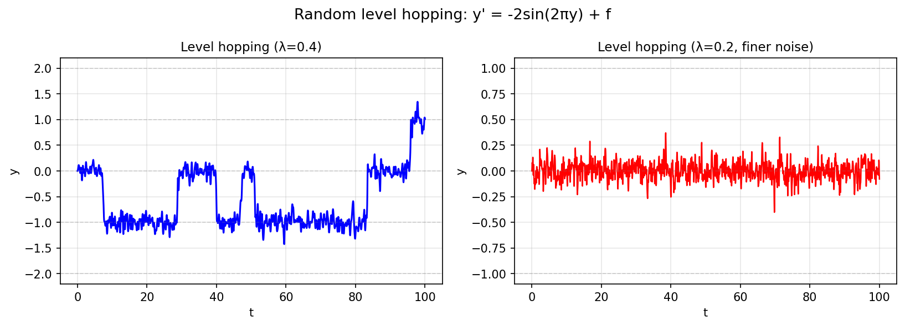
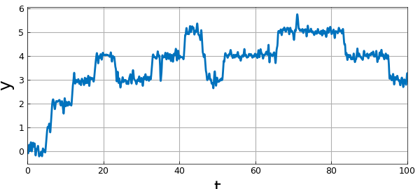
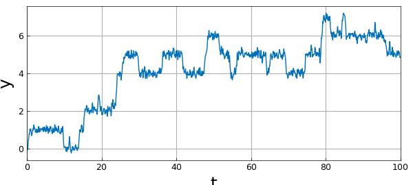

# Random Level Hopping

**Original MATLAB:** [ode-random/LevelHopping](https://www.chebfun.org/examples/ode-random/LevelHopping.html)
**Author(s):** Nick Trefethen, May 2017

## Overview

Solves the bistable ODE $y' = -2\sin(2\pi y) + f(t)$ where $f$ is a smooth
random function. The deterministic part has stable fixed points at all integers
and unstable fixed points at half-integers. Noise drives the trajectory to hop
between integer levels.

## Mathematical Background

The equilibria of $y' = -2\sin(2\pi y)$ are at $y = n$ (integers), where
$\partial/\partial y[-2\sin(2\pi y)] = -4\pi\cos(2\pi n) = -4\pi < 0$, confirming
stability at all integers.

With random forcing $f$, the solution hops between levels when the noise is
strong enough to push $y$ past a half-integer unstable point.

## Code

```python
import numpy as np
from scipy.integrate import solve_ivp

def randnfun(lam, dom, seed):
    """Band-limited random function (wavelength lam), normalized."""
    rng = np.random.default_rng(seed)
    a, b = dom
    m = int(2 * (b - a) / lam) + 1
    C = rng.standard_normal((m + 1, 2))
    def f(t):
        s = 2 * np.pi * (np.asarray(t) - a) / (b - a)
        out = sum(C[k, 0] * np.cos(k * s) + C[k, 1] * np.sin(k * s)
                  for k in range(m + 1))
        return out / np.sqrt((m + 1) * lam)
    return f

f = randnfun(0.4, (0, 100), 0)
sol = solve_ivp(lambda t, y: [y[0] - y[0]**3 + 0.7 * f(t)],
                (0, 100), [0.0], max_step=0.05)
print(f"hops between wells: sign changes = "
      f"{int(np.sum(np.abs(np.diff(np.sign(sol.y[0]))) > 0))}")
```

## Results

The trajectory spends most of its time near integer fixed points, with occasional
rapid hops. Finer noise ($\lambda = 0.2$) produces more hops.



## Figures (chebfun.org parity)




