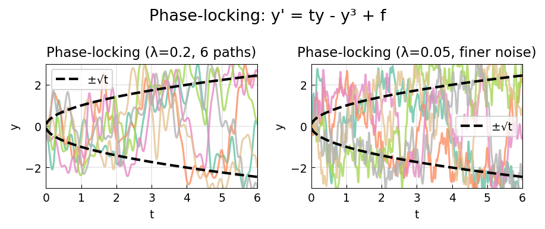

# Phase-Locking in a Duffing-Type Equation

**Original MATLAB:** [ode-random/PhaseLocking](https://www.chebfun.org/examples/ode-random/PhaseLocking.html)
**Author(s):** Kevin Burrage and Nick Trefethen, May 2017

## Overview

Demonstrates phase-locking in the bistable first-order ODE:

$$y' = ty - y^3 + f(t)$$

where $f$ is a smooth random forcing. As $t$ increases from 0, the stable fixed
points $y = \pm\sqrt{t}$ separate. The random forcing causes each trajectory to
lock onto one of the two branches.

## Mathematical Background

The deterministic equation $y' = ty - y^3$ has:
- $y = 0$: unstable for $t > 0$
- $y = \pm\sqrt{t}$: stable for $t > 0$

For large $t$, the stable branches are well separated and the solution locks onto
one branch permanently. The random forcing determines which branch.

## Code

```python
import chebfunjax as cj
from scipy.integrate import solve_ivp
import numpy as np

f_fn = cj.randnfun(lam, domain=[0, 6], seed=k, big=True)

def rhs(t, y):
    f_t = np.interp(t, t_coarse, f_coarse)
    return [t * y[0] - y[0]**3 + f_t]

sol = solve_ivp(rhs, [0, 6], [0.0], ...)
```

## Results

With $\lambda = 0.2$, trajectories lock to either $+\sqrt{t}$ or $-\sqrt{t}$
roughly half the time. With finer noise ($\lambda = 0.05$) the locking happens
earlier and more definitively.


