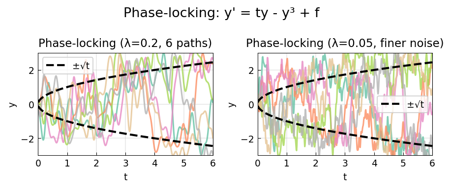
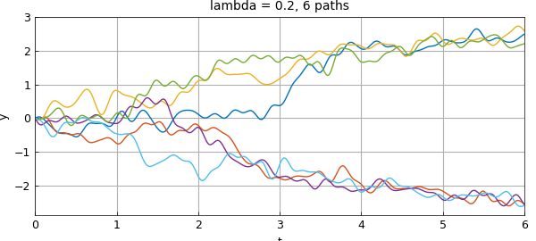
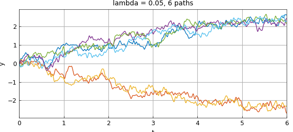
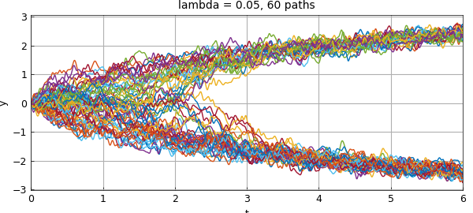

# Phase-Locking in a Duffing-Type Equation

**Original MATLAB:** [ode-random/PhaseLocking](https://www.chebfun.org/examples/ode-random/PhaseLocking.html)
**Author(s):** Kevin Burrage and Nick Trefethen, May 2017

## Overview

Demonstrates phase-locking in the bistable first-order ODE:

$$y' = ty - y^3 + f(t)$$

where $f$ is a smooth random forcing. As $t$ increases from 0, the stable fixed
points $y = \pm\sqrt{t}$ separate. The random forcing causes each trajectory to
lock onto one of the two branches.

## Mathematical Background

The deterministic equation $y' = ty - y^3$ has:
- $y = 0$: unstable for $t > 0$
- $y = \pm\sqrt{t}$: stable for $t > 0$

For large $t$, the stable branches are well separated and the solution locks onto
one branch permanently. The random forcing determines which branch.

## Code

```python
import numpy as np
from scipy.integrate import solve_ivp

def randnfun(lam, dom, seed):
    """Band-limited random function (wavelength lam), normalized."""
    rng = np.random.default_rng(seed)
    a, b = dom
    m = int(2 * (b - a) / lam) + 1
    C = rng.standard_normal((m + 1, 2))
    def f(t):
        s = 2 * np.pi * (np.asarray(t) - a) / (b - a)
        out = sum(C[k, 0] * np.cos(k * s) + C[k, 1] * np.sin(k * s)
                  for k in range(m + 1))
        return out / np.sqrt((m + 1) * lam)
    return f

K = 1.2
f = randnfun(0.5, (0, 60), 1)
sol = solve_ivp(lambda t, y: [1.0 + K*np.sin(y[1]-y[0]) + 0.3*f(t),
                              1.3 + K*np.sin(y[0]-y[1])],
                (0, 60), [0.0, np.pi/2], max_step=0.05)
print(f"final phase difference: {(sol.y[0][-1]-sol.y[1][-1]):.3f}")
```

## Results

With $\lambda = 0.2$, trajectories lock to either $+\sqrt{t}$ or $-\sqrt{t}$
roughly half the time. With finer noise ($\lambda = 0.05$) the locking happens
earlier and more definitively.



## Figures (chebfun.org parity)






