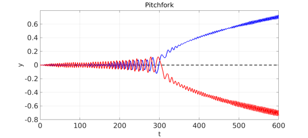
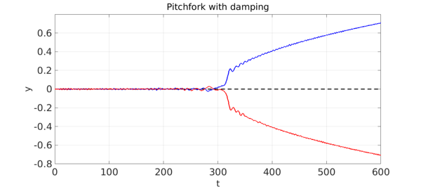

<!-- Generated by scripts/sync_chebfun_examples.py. -->
<!-- Source: https://www.chebfun.org/examples/ode-random/Pitchfork.html -->

<h1>Pitchfork bifurcation triggered by noise</h1>
<h2>Nick Trefethen, May 2017 in <a href='../'>ode-random</a><a href='/examples/ode-random/Pitchfork.m'>download</a>&middot;<a href='//github.com/chebfun/examples/blob/master/ode-random/Pitchfork.m'>view on GitHub</a></h2>

The second-order ODE $$ y'' = 2\kern .3pt cy - 4y^3 $$ has fixed points $y=0$, $y = \sqrt{c/2}$ and $y = -\sqrt{c/2}$. For $c&lt;0$, only the first of these is real, and it is a stable fixed point.  As $c$ passes through zero to values $c&gt;0$, the other two fixed points emerge, and now $y=0$ is unstable and the other two are stable.  This is a pitchfork bifurcation.

One way to see the bifurcation in a single ODE computation is to consider a time-dependent problem with a coefficient $c(t)$ that slowly increases through zero, like this: $$ y'' = 2\kern .3pt c(t)y - 4y^3, ~~~ c(t) = -1+t/300, ~~ t \in [0, 600].  $$ If the initial condition is $y(0) = 0$, then the solution is $y(t)=0$ for all $t$ --- the solution never notices the instability.

However, suppose we add noise in the form of a random function of small amplitude, like this: $$ y'' = 2\kern .3pt c(t)y - 4y^3 + 0.003f(t), ~~~ c(t) = -1+t/300, ~~ t \in [0, 600].  $$ Now the solution will, at random, deviate to one or the other branch of the pitchfork.  Here we show three solutions: two with noise, and one without (the dashed middle line).

<pre class="mcode-input">tic
rng(0), lambda = 2;
N = chebop(0,600); N.lbc = [0;0];
N.op = @(t,y) diff(y,2) - 2*(-1+t/300)*y + 4*y^3;
FS = 'fontsize'; LW = 'linewidth'; lw = 2.5;
y1 = N\0; plot(y1,'--k',LW,lw), hold on
f1 = 0.003*randnfun([0 600],lambda,'norm');
y2 = N\f1; plot(y2,'b',LW,lw),
f2 = 0.003*randnfun([0 600],lambda,'norm');
y3 = N\f2; plot(y3,'r',LW,lw), hold off
xlabel('t',FS,32), ylabel('y',FS,32)
title('Pitchfork',FS,32)
axis([0 600 -.8 .8]), grid on</pre>

Note that the solutions display big oscillations.  Adding a damping term $0.2y'$ to the equation changes this a good deal.

<pre class="mcode-input">N.op = @(t,y) diff(y,2) - 2*(-1+t/300)*y + 4*y^3 + 0.2*diff(y);
plot(y1,'--k',LW,lw), hold on
y2 = N\(-f1); plot(y2,'b',LW,lw),
y3 = N\f2; plot(y3,'r',LW,lw), hold off
xlabel('t',FS,32), ylabel('y',FS,32)
title('Pitchfork with damping',FS,32)
axis([0 600 -.8 .8]), grid on</pre>

When we first tried this, both branches went negative. So we flipped the sign on one of them.

This example has connections with the example "Phase-locking in a Duffing-type equation", though that involves a first-order ODE.

<pre class="mcode-input">total_time_in_seconds = toc</pre>

<pre class="mcode-output">total_time_in_seconds =
  17.422788000000001
</pre>

        

    

