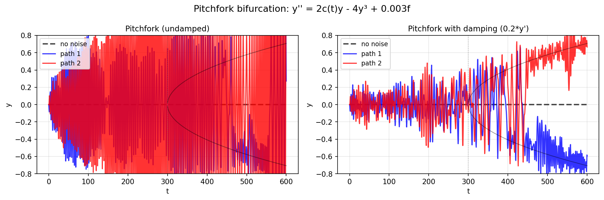

# Pitchfork Bifurcation Triggered by Noise

**Original MATLAB:** [ode-random/Pitchfork](https://www.chebfun.org/examples/ode-random/Pitchfork.html)
**Author:** Nick Trefethen (May 2017)

## Overview

The second-order ODE

$$y'' = 2c(t)y - 4y^3 + 0.003 f(t), \quad c(t) = -1 + t/300, \quad t \in [0, 600]$$

undergoes a pitchfork bifurcation as $c(t)$ passes through zero at $t = 300$.
Without noise, the solution stays at $y = 0$ indefinitely. With a small random
forcing, the trajectory deviates randomly to one of the stable branches.

## Mathematical Background

Fixed points of $y'' = 2cy - 4y^3$:
- $y = 0$: stable for $c < 0$, unstable for $c > 0$
- $y = \pm\sqrt{c/2}$: emerge at $c = 0$, stable for $c > 0$

This is the classic supercritical pitchfork bifurcation. The parameter $c(t) = -1 + t/300$
increases slowly, crossing zero at $t = 300$.

Adding a damping term $0.2y'$ greatly reduces the oscillations that occur near bifurcation.

## Code

```python
import chebfunjax as cj
from scipy.integrate import solve_ivp
import numpy as np

def rhs(t, y):
    ct = -1.0 + t / 300.0
    f_t = np.interp(t, t_coarse, f_coarse)
    return [y[1],
            2.0 * ct * y[0] - 4.0 * y[0]**3 + eps * f_t - damping * y[1]]

sol = solve_ivp(rhs, [0, 600], [0.0, 0.0], ...)
```

## Results

Without noise, the solution stays at $y = 0$. With small noise, it randomly
locks onto $y = +\sqrt{c(t)/2}$ or $y = -\sqrt{c(t)/2}$. Adding damping
reduces oscillatory behavior.


