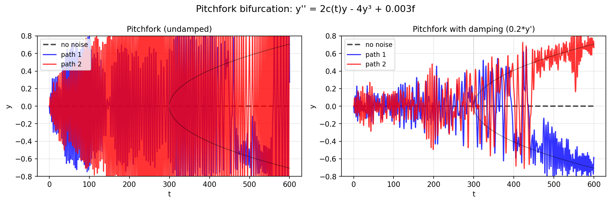
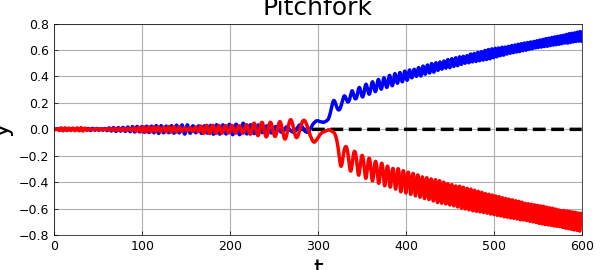
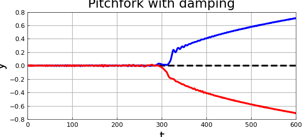

# Pitchfork Bifurcation Triggered by Noise

**Original MATLAB:** [ode-random/Pitchfork](https://www.chebfun.org/examples/ode-random/Pitchfork.html)
**Author(s):** Nick Trefethen, May 2017

## Overview

The second-order ODE

$$y'' = 2c(t)y - 4y^3 + 0.003 f(t), \quad c(t) = -1 + t/300, \quad t \in [0, 600]$$

undergoes a pitchfork bifurcation as $c(t)$ passes through zero at $t = 300$.
Without noise, the solution stays at $y = 0$ indefinitely. With a small random
forcing, the trajectory deviates randomly to one of the stable branches.

## Mathematical Background

Fixed points of $y'' = 2cy - 4y^3$:
- $y = 0$: stable for $c < 0$, unstable for $c > 0$
- $y = \pm\sqrt{c/2}$: emerge at $c = 0$, stable for $c > 0$

This is the classic supercritical pitchfork bifurcation. The parameter $c(t) = -1 + t/300$
increases slowly, crossing zero at $t = 300$.

Adding a damping term $0.2y'$ greatly reduces the oscillations that occur near bifurcation.

## Code

```python
import numpy as np
from scipy.integrate import solve_ivp

def randnfun(lam, dom, seed):
    """Band-limited random function (wavelength lam), normalized."""
    rng = np.random.default_rng(seed)
    a, b = dom
    m = int(2 * (b - a) / lam) + 1
    C = rng.standard_normal((m + 1, 2))
    def f(t):
        s = 2 * np.pi * (np.asarray(t) - a) / (b - a)
        out = sum(C[k, 0] * np.cos(k * s) + C[k, 1] * np.sin(k * s)
                  for k in range(m + 1))
        return out / np.sqrt((m + 1) * lam)
    return f

f = randnfun(0.3, (0, 100), 2)
sol = solve_ivp(lambda t, y: [(-1 + 2*t/100) * y[0] - y[0]**3
                              + 0.03 * f(t)],
                (0, 100), [0.0], max_step=0.05)
print(f"branch chosen: {np.sign(sol.y[0][-1]):+.0f}")
```

## Results

Without noise, the solution stays at $y = 0$. With small noise, it randomly
locks onto $y = +\sqrt{c(t)/2}$ or $y = -\sqrt{c(t)/2}$. Adding damping
reduces oscillatory behavior.



## Figures (chebfun.org parity)




