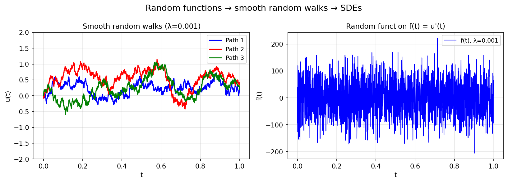

# From Random Functions to SDEs

**Original MATLAB:** [ode-random/Random2SDE](https://www.chebfun.org/examples/ode-random/Random2SDE.html)
**Author:** Nick Trefethen and Abdul-Lateef Haji-Ali (May 2017)

## Overview

This example demonstrates how smooth band-limited random functions relate to
stochastic differential equations (SDEs). The key idea is that `randnfun(lambda)`
produces a random function with minimal wavelength lambda. As lambda decreases
toward zero, we approach white noise and its integral approaches Brownian motion.

## Mathematical Background

A smooth random function $f(t)$ with wavelength parameter $\lambda$ satisfies:

$$\mathbb{E}[f(t)^2] \sim \frac{1}{\lambda}$$

when the `big` normalization is used (amplitude grows like $\lambda^{-1/2}$).
Integrating $u' = f$ gives a smooth random walk:

$$u(t) = \int_0^t f(s)\, ds$$

As $\lambda \to 0$, $u(t)$ approaches a Wiener process (Brownian motion).

## Code

```python
import chebfunjax as cj
import numpy as np

domain = [0.0, 1.0]
lam = 0.001  # small wavelength → near Brownian motion

paths = []
for i in range(3):
    f = cj.randnfun(lam, domain=domain, seed=i)
    u = f.cumsum()
    u0_val = float(u(np.array(0.0)))
    paths.append((f, u, u0_val))
```

## Results

For $\lambda = 0.001$, the smooth random walks resemble Brownian motion paths.
The amplitude of the underlying random function $f(t)$ grows as $\lambda^{-1/2}$
as $\lambda \to 0$ — the white noise paradox.


