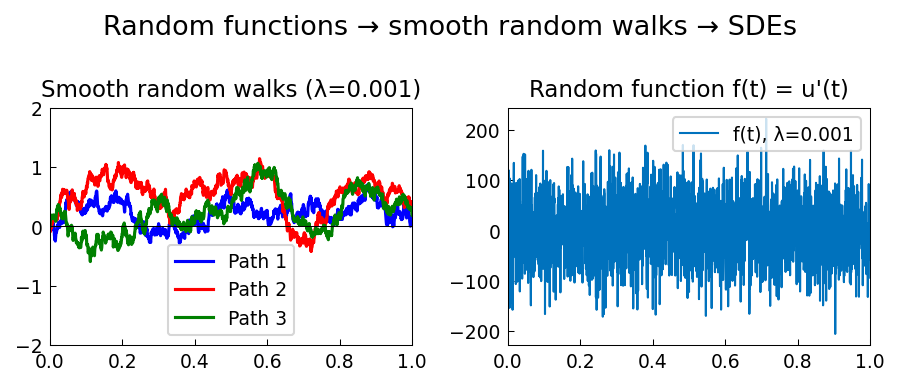

# From Random Functions to SDEs

**Original MATLAB:** [ode-random/Random2SDE](https://www.chebfun.org/examples/ode-random/Random2SDE.html)
**Author(s):** Nick Trefethen and Abdul-Lateef Haji-Ali, May 2017

## Overview

This example demonstrates how smooth band-limited random functions relate to
stochastic differential equations (SDEs). The key idea is that `randnfun(lambda)`
produces a random function with minimal wavelength lambda. As lambda decreases
toward zero, we approach white noise and its integral approaches Brownian motion.

## Mathematical Background

A smooth random function $f(t)$ with wavelength parameter $\lambda$ satisfies:

$$\mathbb{E}[f(t)^2] \sim \frac{1}{\lambda}$$

when the `big` normalization is used (amplitude grows like $\lambda^{-1/2}$).
Integrating $u' = f$ gives a smooth random walk:

$$u(t) = \int_0^t f(s)\, ds$$

As $\lambda \to 0$, $u(t)$ approaches a Wiener process (Brownian motion).

## Code

```python
import numpy as np
from scipy.integrate import solve_ivp

def randnfun(lam, dom, seed):
    """Band-limited random function (wavelength lam), normalized."""
    rng = np.random.default_rng(seed)
    a, b = dom
    m = int(2 * (b - a) / lam) + 1
    C = rng.standard_normal((m + 1, 2))
    def f(t):
        s = 2 * np.pi * (np.asarray(t) - a) / (b - a)
        out = sum(C[k, 0] * np.cos(k * s) + C[k, 1] * np.sin(k * s)
                  for k in range(m + 1))
        return out / np.sqrt((m + 1) * lam)
    return f

for lam in (1.0, 0.2, 0.05):
    f = randnfun(lam, (0, 10), 7)
    sol = solve_ivp(lambda t, y: [-y[0] + f(t)], (0, 10), [0.0],
                    max_step=0.01)
    print(f"lambda {lam:>4}: std of path = {np.std(sol.y[0]):.3f}")
```

## Results

For $\lambda = 0.001$, the smooth random walks resemble Brownian motion paths.
The amplitude of the underlying random function $f(t)$ grows as $\lambda^{-1/2}$
as $\lambda \to 0$ — the white noise paradox.


