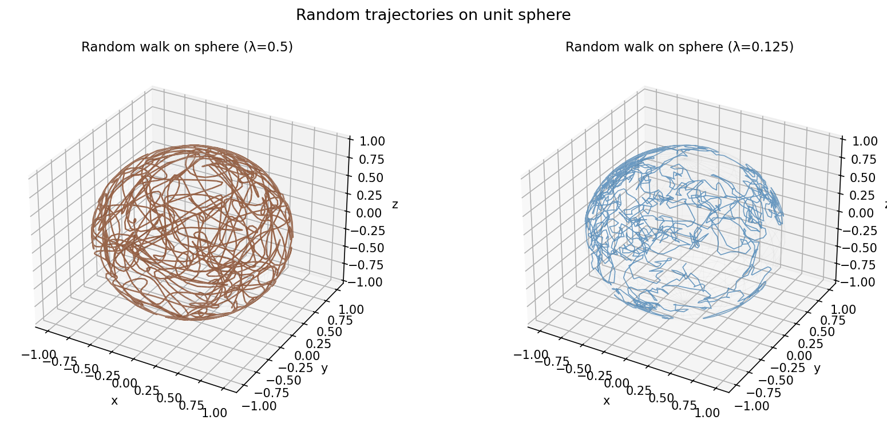

# Random Trajectory on a Sphere

**Original MATLAB:** [ode-random/RandomOnASphere](https://www.chebfun.org/examples/ode-random/RandomOnASphere.html)
**Author:** Kevin Burrage and Nick Trefethen (May 2017)

## Overview

The system $du/dt = f(t)Au + g(t)Bu + h(t)Cu$ where $A$, $B$, $C$ are skew-symmetric
matrices and $f$, $g$, $h$ are random functions generates a random trajectory that
wanders on the unit sphere. Energy $\|u\|^2 = 1$ is preserved exactly because
skew-symmetric coefficient matrices conserve norms.

## Mathematical Background

The skew-symmetric matrices generating SO(3) rotations:

$$A = \begin{pmatrix} 0 & 1 & 0 \\ -1 & 0 & 0 \\ 0 & 0 & 0 \end{pmatrix}, \quad
B = \begin{pmatrix} 0 & 0 & 1 \\ 0 & 0 & 0 \\ -1 & 0 & 0 \end{pmatrix}, \quad
C = \begin{pmatrix} 0 & 0 & 0 \\ 0 & 0 & 1 \\ 0 & -1 & 0 \end{pmatrix}$$

For any skew-symmetric $M$: $\frac{d}{dt}\|u\|^2 = 2u^T (fA+gB+hC)u = 0$, so
$\|u(t)\| = \|u(0)\| = 1$ for all $t$.

## Code

```python
import chebfunjax as cj
from scipy.integrate import solve_ivp

f_fn = cj.randnfun(lam, domain=[0,100], seed=0)
g_fn = cj.randnfun(lam, domain=[0,100], seed=1)
h_fn = cj.randnfun(lam, domain=[0,100], seed=2)

def rhs(t, u):
    fi, gi, hi = [np.interp(t, t_grid, v) for v in [f_vals, g_vals, h_vals]]
    M = fi * A + gi * B + hi * C
    return M @ u

sol = solve_ivp(rhs, [0, 100], u0, ...)
```

## Results

The trajectory $u(t) = (x(t), y(t), z(t))^T$ wanders ergodically over the
unit sphere, with the exact unit norm preserved to numerical precision.


