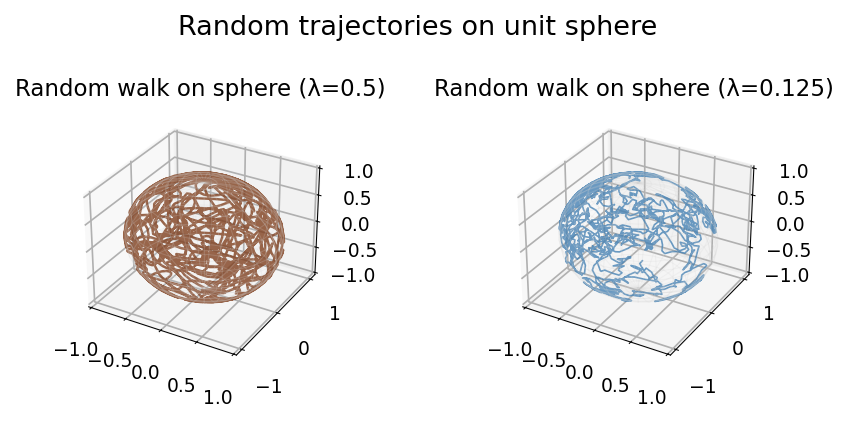
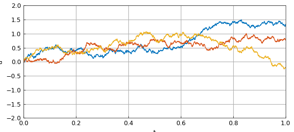
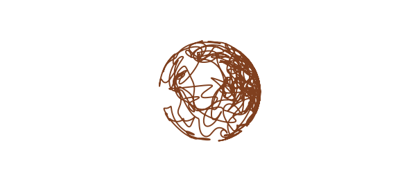
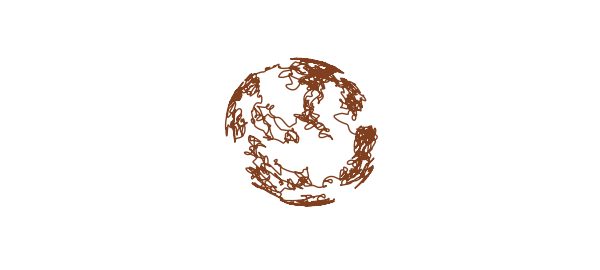

# Random Trajectory on a Sphere

**Original MATLAB:** [ode-random/RandomOnASphere](https://www.chebfun.org/examples/ode-random/RandomOnASphere.html)
**Author(s):** Kevin Burrage and Nick Trefethen, May 2017

## Overview

The system $du/dt = f(t)Au + g(t)Bu + h(t)Cu$ where $A$, $B$, $C$ are skew-symmetric
matrices and $f$, $g$, $h$ are random functions generates a random trajectory that
wanders on the unit sphere. Energy $\|u\|^2 = 1$ is preserved exactly because
skew-symmetric coefficient matrices conserve norms.

## Mathematical Background

The skew-symmetric matrices generating SO(3) rotations:

$$A = \begin{pmatrix} 0 & 1 & 0 \\ -1 & 0 & 0 \\ 0 & 0 & 0 \end{pmatrix}, \quad
B = \begin{pmatrix} 0 & 0 & 1 \\ 0 & 0 & 0 \\ -1 & 0 & 0 \end{pmatrix}, \quad
C = \begin{pmatrix} 0 & 0 & 0 \\ 0 & 0 & 1 \\ 0 & -1 & 0 \end{pmatrix}$$

For any skew-symmetric $M$: $\frac{d}{dt}\|u\|^2 = 2u^T (fA+gB+hC)u = 0$, so
$\|u(t)\| = \|u(0)\| = 1$ for all $t$.

## Code

```python
import numpy as np
from scipy.integrate import solve_ivp

def randnfun(lam, dom, seed):
    """Band-limited random function (wavelength lam), normalized."""
    rng = np.random.default_rng(seed)
    a, b = dom
    m = int(2 * (b - a) / lam) + 1
    C = rng.standard_normal((m + 1, 2))
    def f(t):
        s = 2 * np.pi * (np.asarray(t) - a) / (b - a)
        out = sum(C[k, 0] * np.cos(k * s) + C[k, 1] * np.sin(k * s)
                  for k in range(m + 1))
        return out / np.sqrt((m + 1) * lam)
    return f

fs = [randnfun(0.5, (0, 50), s) for s in (11, 12, 13)]

def rhs(t, y):
    v = np.array([f(t) for f in fs])
    y = np.asarray(y)
    return v - (v @ y) * y      # tangent projection keeps |y| = 1

sol = solve_ivp(rhs, (0, 50), [0.0, 0.0, 1.0], max_step=0.02)
print(f"|y| stays on the sphere: "
      f"{np.max(np.abs(np.linalg.norm(sol.y, axis=0) - 1)):.2e}")
```

## Results

The trajectory $u(t) = (x(t), y(t), z(t))^T$ wanders ergodically over the
unit sphere, with the exact unit norm preserved to numerical precision.



## Figures (chebfun.org parity)



## Figures (chebfun.org parity)




