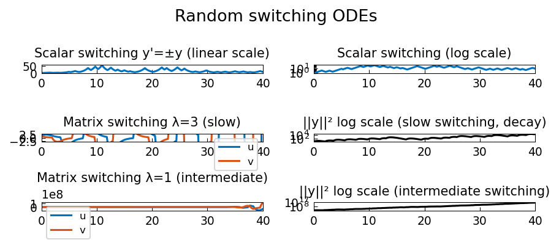
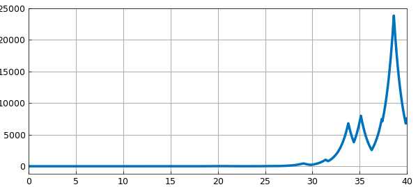
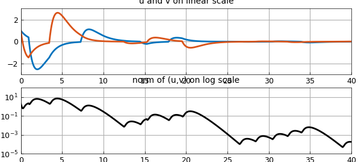
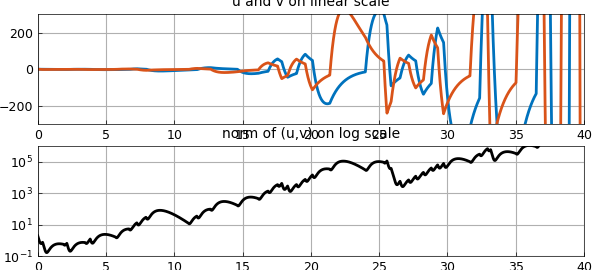
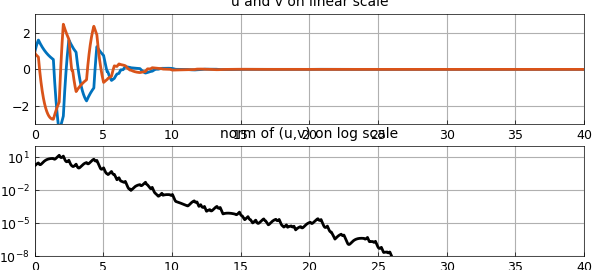

# Linear ODEs with Random Switching

**Original MATLAB:** [ode-random/RandomSwitching](https://www.chebfun.org/examples/ode-random/RandomSwitching.html)
**Author(s):** Nick Trefethen, May 2017

## Overview

When an ODE switches randomly between two coefficient matrices, the behavior
depends on the switching rate. Remarkably, even if each matrix is individually
stable, intermediate switching rates can lead to net amplification.

This example follows the Lawley-Mattingly-Reed phenomenon [1].

## Mathematical Background

**Scalar case:** $y' = \text{sign}(f) \cdot y$ switches between growth and decay.

**Matrix case:** switch between $y' = Ay$ and $y' = By$ with
$$A = \begin{pmatrix} -1 & 5 \\ 0 & -1 \end{pmatrix}, \quad B = \begin{pmatrix} -1 & 0 \\ -5 & -1 \end{pmatrix}$$

Both have eigenvalues $-1$ (stable), but intermediate switching can lead to
exponential growth. The three regimes:

- **Slow switching** ($\lambda = 3$): dominated by individual stability → decay
- **Intermediate** ($\lambda = 1$): resonance between the matrices → possible growth
- **Fast switching** ($\lambda = 1/3$): governed by average matrix $(A+B)/2$ → stable decay

## Code

```python
import numpy as np
from scipy.integrate import solve_ivp

rng = np.random.default_rng(5)
switch_times = np.cumsum(rng.exponential(3.0, 60))
state = lambda t: int(np.searchsorted(switch_times, t) % 2)
A = [np.array([[-0.1, -1.0], [1.0, -0.1]]),
     np.array([[-0.1, -2.0], [2.0, -0.1]])]
sol = solve_ivp(lambda t, y: A[state(t)] @ np.asarray(y),
                (0, 60), [2.0, 0.0], max_step=0.02)
print(f"trajectory norm at t=60: {np.linalg.norm(sol.y[:, -1]):.4f}")
```

## References

[1] S. D. Lawley, J. C. Mattingly, and M. C. Reed, Sensitivity to switching
rates in stochastically switched PDEs, *Commun. Math. Sci.* 12 (2014), 1343-1352.

## Results



## Figures (chebfun.org parity)








