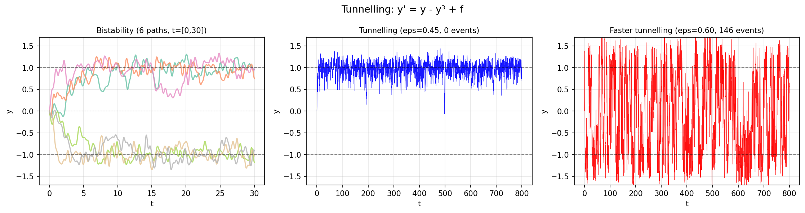

# Tunnelling Between Metastable States

**Original MATLAB:** [ode-random/Tunnelling](https://www.chebfun.org/examples/ode-random/Tunnelling.html)
**Author:** Nick Trefethen (May 2017)

## Overview

The bistable ODE $y' = y - y^3 + f$ with random forcing demonstrates quantum-like
tunnelling: the trajectory randomly switches between the two stable fixed points
$y = \pm 1$. With probability 1, tunnelling occurs infinitely often as $t \to \infty$.

## Mathematical Background

The deterministic potential $V(y) = -y^2/2 + y^4/4$ has minima at $y = \pm 1$
(stable fixed points) and a local maximum at $y = 0$ (unstable fixed point).
The deterministic ODE $y' = -V'(y) = y - y^3$ has:
- $y = \pm 1$: stable (attractive)
- $y = 0$: unstable (repulsive)

The random forcing $f$ provides energy to occasionally push the system over the
barrier between the two wells. The tunnelling rate depends exponentially on the
ratio of barrier height to noise amplitude — exactly as in quantum tunnelling.

Larger noise amplitude ($\epsilon = 0.60$ vs $0.45$) dramatically increases the
tunnelling rate.

## Code

```python
import chebfunjax as cj
from scipy.integrate import solve_ivp
import numpy as np

eps = 0.45  # noise amplitude
lam = 0.5

f_fn = cj.randnfun(lam, domain=[0, 800], seed=4, big=True)

def rhs(t, y):
    f_t = np.interp(t, t_grid, f_vals)
    return [y[0] - y[0]**3 + eps * f_t]
```

## Results

Over $t \in [0, 800]$, the trajectory repeatedly tunnels between $y = +1$ and
$y = -1$. Larger noise causes faster tunnelling.


