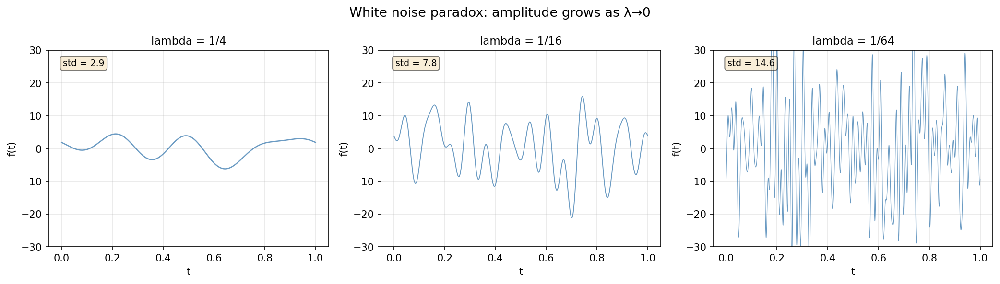

# The White Noise Paradox

**Original MATLAB:** [ode-random/WhiteNoiseParadox](https://www.chebfun.org/examples/ode-random/WhiteNoiseParadox.html)
**Author:** Nick Trefethen (May 2017)

## Overview

White noise contains equal energy at all frequencies. Since there are infinitely
many frequencies, white noise has infinite amplitude — the white noise paradox.
This is analogous to the ultraviolet catastrophe in 19th-century physics.

The example shows how `randnfun(lambda)` with the `big` normalization has
amplitude growing as $\lambda^{-1/2}$, diverging as $\lambda \to 0$.

## Mathematical Background

A band-limited random function $f(t)$ with wavenumber cutoff $\sim 2\pi/\lambda$
satisfies

$$\mathbb{E}[f(t)^2] \sim \lambda^{-1}$$

under the `big` normalization. This is the discrete analog of the white noise
divergence. As $\lambda \to 0$:

$$\text{std}(f) \sim \lambda^{-1/2} \to \infty$$

**Resolution:** Stochastic analysis avoids white noise directly and works only
with its integral (the Wiener process / Brownian motion), which is bounded with
probability 1 due to sign cancellations.

**Physics parallel:** Einstein's 1905 papers on Brownian motion and the photoelectric
effect both relate to this paradox. Planck's quantization and the ultraviolet
catastrophe connect directly to the finite-energy resolution.

## Code

```python
import chebfunjax as cj
import numpy as np

for lam in [1/4, 1/16, 1/64]:
    f = cj.randnfun(lam, domain=[0,1], seed=1, big=True)
    f_vals = [float(f(np.array(t))) for t in t_eval]
    print(f"lambda={lam}: std = {np.std(f_vals):.2f}")
    # Output: std grows as lambda decreases
```

## Results

The three panels show random functions with decreasing $\lambda$, each with
growing amplitude demonstrating the white noise paradox.


