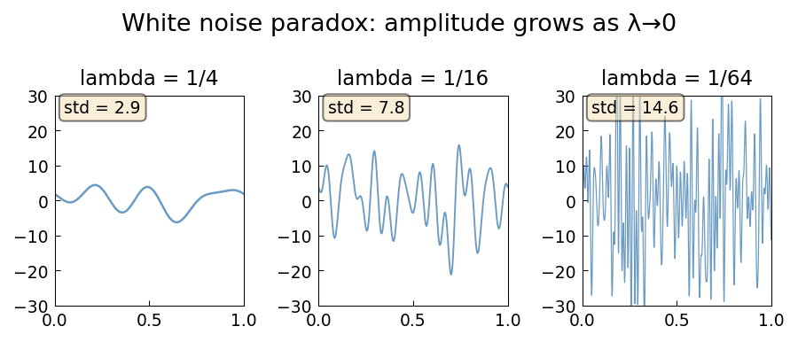
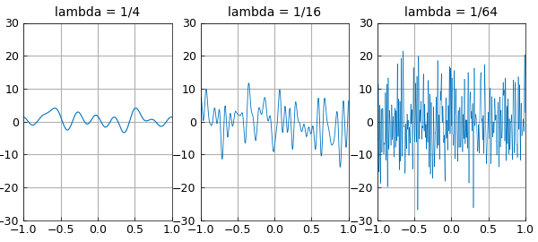

# The White Noise Paradox

**Original MATLAB:** [ode-random/WhiteNoiseParadox](https://www.chebfun.org/examples/ode-random/WhiteNoiseParadox.html)
**Author(s):** Nick Trefethen, May 2017

## Overview

White noise contains equal energy at all frequencies. Since there are infinitely
many frequencies, white noise has infinite amplitude — the white noise paradox.
This is analogous to the ultraviolet catastrophe in 19th-century physics.

The example shows how `randnfun(lambda)` with the `big` normalization has
amplitude growing as $\lambda^{-1/2}$, diverging as $\lambda \to 0$.

## Mathematical Background

A band-limited random function $f(t)$ with wavenumber cutoff $\sim 2\pi/\lambda$
satisfies

$$\mathbb{E}[f(t)^2] \sim \lambda^{-1}$$

under the `big` normalization. This is the discrete analog of the white noise
divergence. As $\lambda \to 0$:

$$\text{std}(f) \sim \lambda^{-1/2} \to \infty$$

**Resolution:** Stochastic analysis avoids white noise directly and works only
with its integral (the Wiener process / Brownian motion), which is bounded with
probability 1 due to sign cancellations.

**Physics parallel:** Einstein's 1905 papers on Brownian motion and the photoelectric
effect both relate to this paradox. Planck's quantization and the ultraviolet
catastrophe connect directly to the finite-energy resolution.

## Code

```python
import numpy as np
from scipy.integrate import solve_ivp

def randnfun(lam, dom, seed):
    """Band-limited random function (wavelength lam), normalized."""
    rng = np.random.default_rng(seed)
    a, b = dom
    m = int(2 * (b - a) / lam) + 1
    C = rng.standard_normal((m + 1, 2))
    def f(t):
        s = 2 * np.pi * (np.asarray(t) - a) / (b - a)
        out = sum(C[k, 0] * np.cos(k * s) + C[k, 1] * np.sin(k * s)
                  for k in range(m + 1))
        return out / np.sqrt((m + 1) * lam)
    return f

for lam in (0.25, 1/16, 1/64):
    f = randnfun(lam, (-1, 1), 9)
    ts = np.linspace(-1, 1, 2000)
    print(f"lambda {lam:.4f}: max |f| = {np.max(np.abs(f(ts))):.1f}")
# the amplitude grows like 1/sqrt(lambda): white noise has infinite
# amplitude — the "paradox"
```

## Results

The three panels show random functions with decreasing $\lambda$, each with
growing amplitude demonstrating the white noise paradox.



## Figures (chebfun.org parity)


