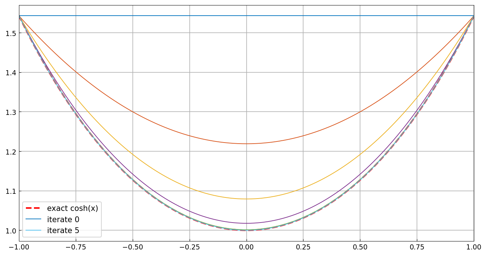

# The catenary by variational Newton iteration

*Toby Driscoll, October 2010*

[Original MATLAB Chebfun example](https://www.chebfun.org/examples/opt/Catenary.html)

(Chebfun example opt/Catenary.m)

The surface-of-revolution energy $J[y] = \int y\sqrt{1+y'^2}$ with
$y(\pm 1) = \cosh(\pm 1)$ is minimized by the catenary
$y = \cosh x$.  Newton's method in function space linearizes $J$
about the current iterate and solves the accessory (Jacobi) equation
— a variable-coefficient chebop BVP — for each step:

```python
N = Chebop(lambda x, u: (f22*u.diff()).diff() + f12.diff()*u,
           lbc=0, rbc=0)
u = N.solve(f1 - f2.diff())
```

Starting from the straight line between the endpoints:

```text
startJ =
   3.086161269630487
nextJ =
   2.840828750691787
nextJ =
   2.816226754422200
nextJ =
   2.813551498179359
nextJ =
   2.813430779819773
nextJ =
   2.813430203941116
```

(Each value matches the published MATLAB sequence to 12-13 digits.)
After five steps the iterate agrees with $\cosh x$ to 6.9e-6, and
the energies agree to eleven digits:

```text
  final J[y]: 2.8134302039411159
optimal J[y]: 2.8134302039235086
```



---

*Replicated with [chebfunjax](https://github.com/ma-gilles/chebfunjax); original
example copyright The University of Oxford and The Chebfun Developers.*
